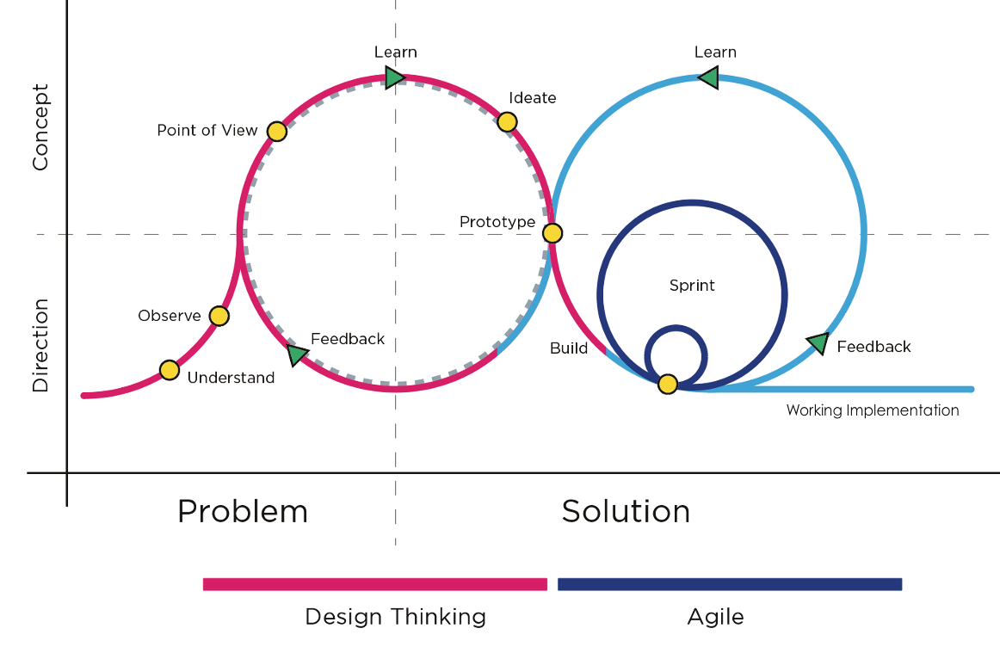
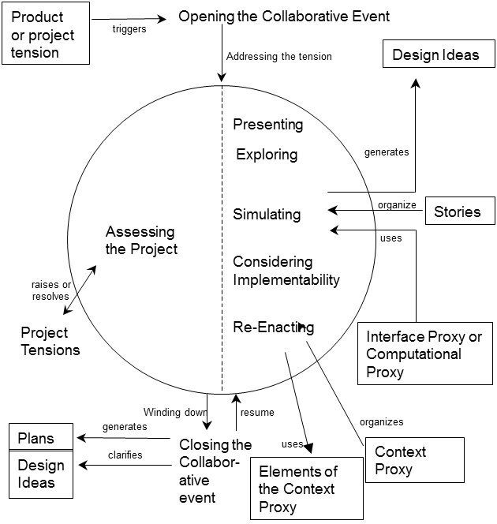
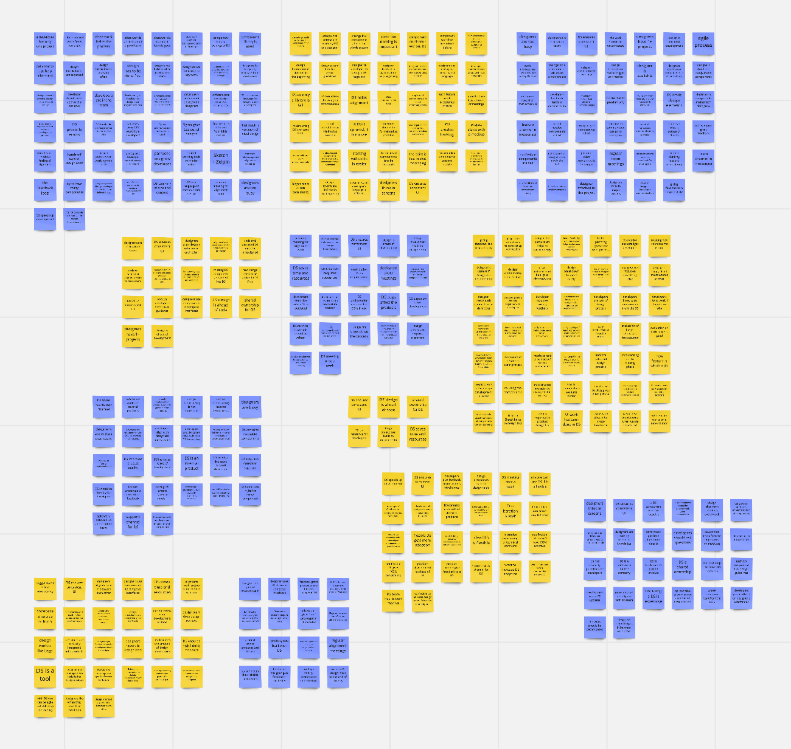
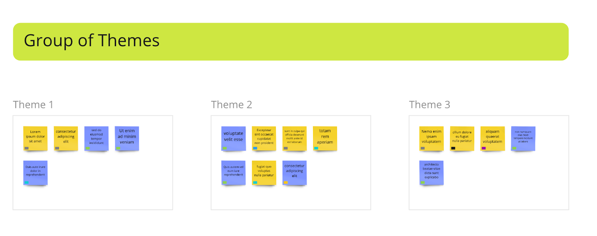
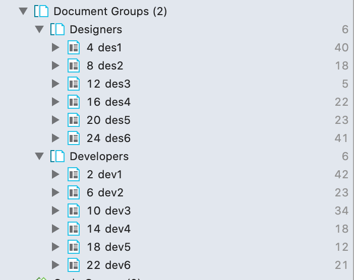
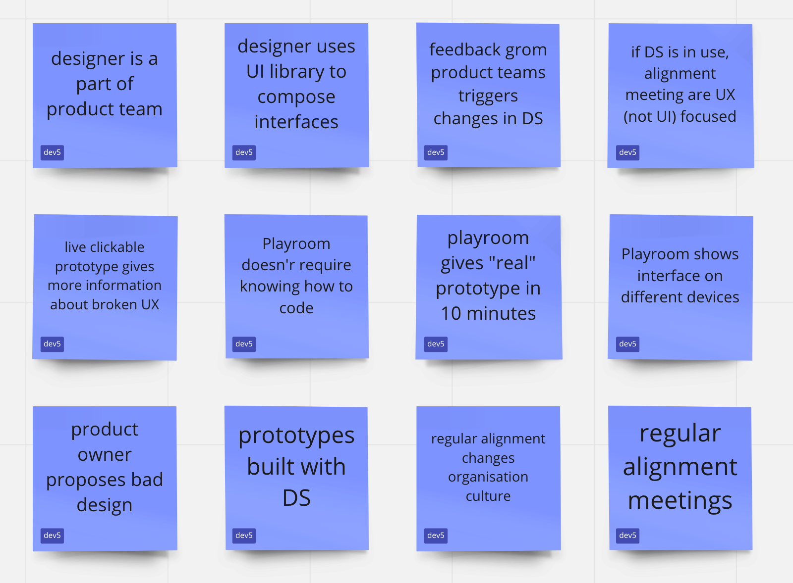
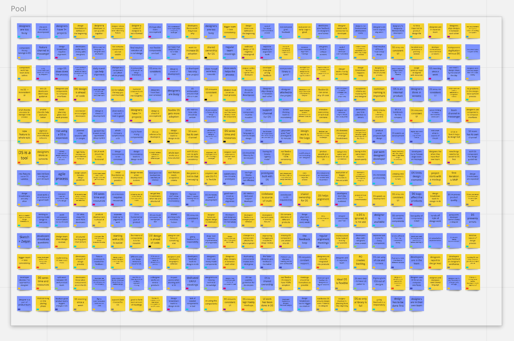
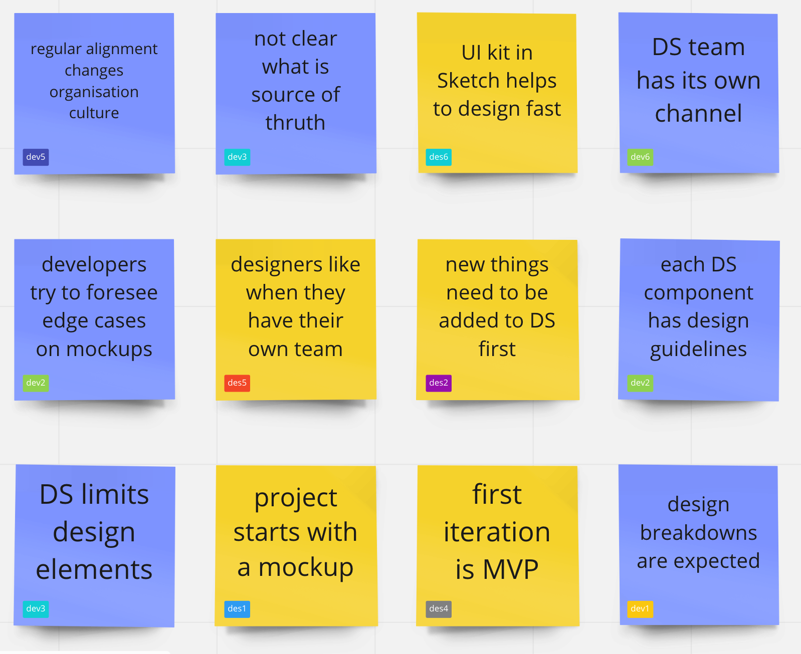
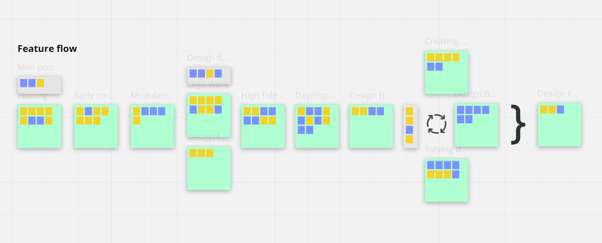
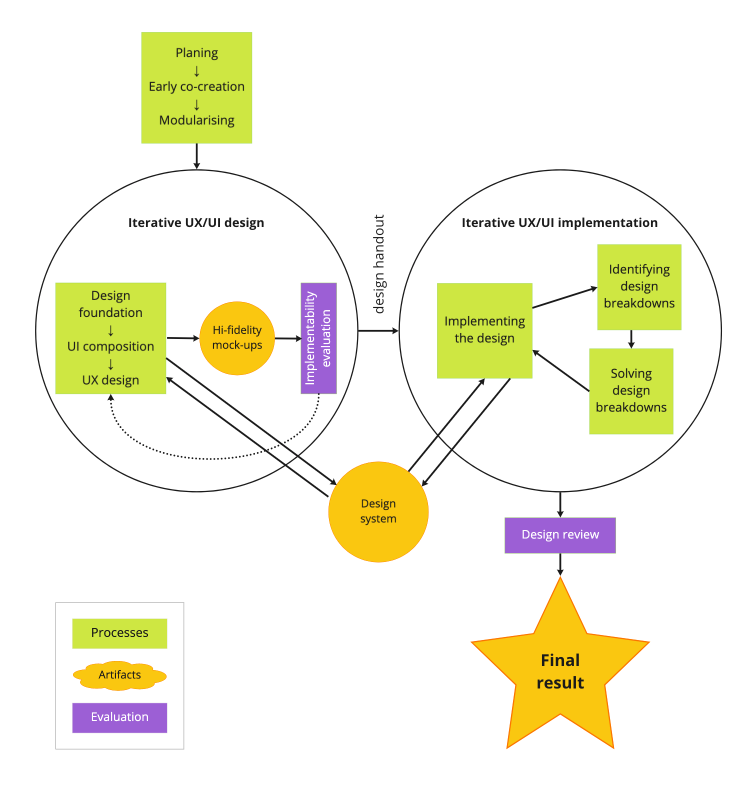

### Abstract

<small>There is a lot of evidence of a significant gap between design and development processes and applied approaches. However, applied together, they form the nowadays’ reality of the UI creation. At the same time, design systems — a relatively new concept emerged in the industry — affects the workflows of designers and developers. It is meant to ensure the implementation of designs and guide the teams through multidisciplinary collaboration.</small>

<small>The aim of this thesis was to study the role of design systems (as an approach and as an artefact) for the UI creation. This research specifically focuses on the alignment between UX interface designers and UI software developers and the impact of design systems on that process.</small>

<small>The results of the research illustrate the new workflow practicing by the design-and-development teams, describe in detail the impact of design systems on the sub-processes of this workflow, and show that using design systems as a part of the software creation process brings the projects and organizations to the highest levels of maturity according to CMMI-DEV representation. These results have both scientific and practical meanings. Using design systems is recommended to speed up the design-and-development process and enhance the maturity level of this process and the organization.
</small>

## 1. Introduction

Both User Centered Design (UCD) and Agile Software Development (ASD) are widely used methods in the production of user interfaces (UI). However, they are “frequently putting contradictory demands on people working with the respective processes” (Jones, 2019). Trying to match different disciplines, the designers and developers are expected to conduct alignment work which brings them to mutual understanding in the context of their work, revealing “design breakdowns” (Maudet et al., 2017) early enough.

Design systems are a yet developing concept of UI development, its definition is different depending on the style of organization. (Huang, 2019) The researcher considered a design system as “a platform that gathers a continuously evolving set of reusable design and development elements of user interfaces that are in line with a company’s brand identity and UX design principles [with] the elements ... organized systematically and presented along with explanations of how each design choice was made” (Konaté, Aïcha, 2018).

Starting to be a new standard in the software creation industry, the design systems play a significant role in the design and development part of this process and influence the collaboration work of a UX designer and a UI developer.

### 1.1. Problem statement

The academic literature contains a lot of evidence of a significant gap between the design and development processes in software creation. This gap can be explained by many reasons such as different mental models of the specialists, different or sometimes conflicting methods they are using to do their job, and the challenges they meet on the process and organisational level.

### 1.2. Motivation and scope of the research

Software creation is nowadays a relevant subject to most companies. As more and more (both external and internal) products are becoming digital, the importance of their efficient and effective building and maintenance grows. Providing well-functioning products is currently a responsibility not only from the business perspective but also from the social one. The UX and UI are the product aspects that actually meet the consumers. This is why the importance of their correct delivery cannot be underestimated. The researcher was motivated to find out the factors helping to overcome the obstacles in delivering good design to the users via its correct development.

### 1.3. Research outline

The research was meant to view the designer and developer collaboration process through the lens of “design systems’. Preliminary research and the working experience of the researcher promised that there might be changes in the flow of alignment work if design systems are involved.

#### Research objectives

To understand the impact of the design systems on the alignment work of designer and developer.

##### Research question

What do the design systems change in the alignment work of designer and developer?

## 2. Theoretical background

The current research concerns the existing scientific knowledge reflected in the academic literature. To ensure the research relevance and accordance with the already introduced concepts, the researcher conducted an extensive literature review. This section reflects the conceptual picture of the domain represented by the most recent scientific sources. The scientific literature was obtained from a search at Google.Scholar web service. There were three major search approaches to get the relevant papers:

1. The search by relevant key phrases such as “design systems”, “maturity models”, “maturity models design systems”, “HCI software engineering”, “agile development user centered design”;
1. The relevant papers mentioned in the references of the papers found in the 1st search;
1. The relevant papers that cite the papers found in the 1st and second search.

All the found papers were analysed by their relevance to the topic and the scope of the research and processed to form a synthesis of the available theoretical information.

### 2.1. Business problem

Many researchers admit the gap between design and development on all the three project-level, process-level, and person-level.

##### Project-level

On the project level, there is often “the gap between design artifacts and their subsequent implementation” (Maudet et al., 2017) meaning that the released product differs from the initial design idea. Maudet et al. highlighted that among the projects they researched “none of the initial implementations were exactly as the original design” (Maudet et al., 2017).

##### Process-level

From the working process perspective, even though “designers and developers are working on the same project”, they are often separated on the organisational level. Developers form project-related teams while designers belong to a design department and contribute to several projects. (Caballero, Moreno and Seffah, 2017; Jones and Thoma, 2019) Such separation becomes a business problem since that “causes inefficiency and is perceived to adversely effect quality of output” (Jones, 2019). As a result, “current practices induce unnecessary rework and cause discrepancies between the original design and the implementation” (Maudet et al., 2017). The working process suffers from a significant delay in making decisions “because people seem reluctant to make decisions on things'' (Jones and Thoma, 2019).

##### Personal-level

On the personal side, the researchers admit the designers’ and developers’ frustration about the working process and outcomes. (Jones, 2019) Designers do not get work satisfaction because “the UX work was not central enough in the development process” (Jones, 2019). Due to the different angles in work (which are explained in more detail later), the ”holistic aspects of the design fail to be implemented correctly causing frustration with the UX designers” (Jones, 2019). Jones and Thoma say that both designers and developers “did not feel part of the same team” (Jones and Thoma, 2019) and that indeed causes motivational and efficiency problems. People face problems in integrating their work, it “has proven difficult, often leading to friction between them” (Maudet et al., 2017). This issue does not help to keep the team spirit and definitely negatively affects the results.

### 2.2. Mental models of designers and developers and their role for the working process

The conceptual differences between UCD and ASD raise a lot of challenges for a multidisciplinary team. Due to “specificities of each role”, designers and developers “look at the same problem with a different perspective” (Neto et al., 2020). The UCD approach is “designing for the whole user experience” while by ASD “work is divided up into chunks and smaller releases” (Jones and Thoma, 2019). This difference makes it difficult to combine two approaches and also nourishes different mentality of designers and developers.

Working as a designer and working as a developer requires different skills, these jobs “focus on different aspects of the design process” (Maudet et al., 2017).
Designers and developers demonstrate different ways of thinking and perceiving the working context. The literature mentioned that “designers usually take a more holistic view on the interaction design and information architecture of a website or product” (Jones, Thoma and Newell, 2016) while the developers tend to modularize the products they are building. For the designers, the iterative approach of ASD “may be averse to their way of thinking and working” (Jones, Thoma and Newell, 2016). From the development perspective, ASD approach requires to work chuck by chuck but this is “making it difficult to consider the holistic design at all times” (Jones and Thoma, 2019).

#### Designers

##### Holistic view (or “a big picture”)

The literature describes the work of designers as “very holistic” (Jones, 2019) and focused on “a page (URL) level” (Jones, 2019).
In the literature, design is described as “more strategic, problem-solving, big-idea process” (Nedeltcheva and Shoikova, 2017). Designers tend to focus on a big picture but, for example, “omit important edge cases from their design documents” (Maudet et al., 2017). Often that emerges only on the development phase and creates a design breakdown which leads to either re-creating designs by the designers in a hurry or to the developers providing their changes which are not aligned with the designers.

##### Flat mock-ups

In particular, the big-picture approach results in flat mock-ups as the artifacts to represent the design vision. Such mock-ups communicate the “worked-out graphic elements (fonts, headers, etc.)” (Jones, 2019) but do not take into account the “necessary details about the interaction layer in-browser” (Jones, 2019). Flat drawings “were effective in communicating the overall idea, but left too many unanswered questions for correct implementation” (Maudet et al., 2017).
The “page-level” mentality also creates obstacles for “taking into account the dynamic nature of the data” (Maudet et al., 2017).

##### Disregards of technical restrictions

Often mentioned that designers may lack technical skills and experience that makes it hard or impossible to foresee design breakdowns for future designs. (Maudet et al., 2017; Jones and Thoma, 2019; Walny et al., 2020) This “leads to uncertainty about design feasibility and can also trigger more dramatic revisions during development” (Walny et al., 2020). Similar is highlighted by Jones in his thesis where he mentions that “designers do not know enough about the technical limitations [..] [and] developers perceived inefficient and redundant work efforts at times during the ASD process” (Jones, 2019).

#### Developers

##### Focus on details

Unlike designers, the developers tend to focus on separate interface elements rather than on the page level. (Jones, 2019) Agile practices widely adopted in the software industry “motivate [development] teams to deliver feature sets of working software in tight iterations” that seems to be an opposite of UX design practices that “require upfront research and analysis” (Zaina, Sharp, and Barroca 2021).

##### Modularisation

Working with flat mock-ups which meant to communicate the design idea, a developer “would [...] laboriously un-pick various aspects of the design to understand how the implementation in the browser would either look or behave during different circumstances” (Jones, 2019). In other words, a developer modularises the holistic design idea to align it with their domain.
Looking to modularise the interfaces, the developers tend to rely more on the text descriptions rather than on their visual representations even though such descriptions “did not clearly convey the look and feel of the interaction to the designers” (Maudet et al., 2017).

##### Lack of early feedback

The literature often points out that developers’ satisfaction with the work process correlates with the intensity of collaboration with the designers. (Jones and Thoma, 2019) In particular, developers value to be co-located with the designers as this makes it easier to get the missing information when a design breakdown occurs during the implementation phase. This signals the frequency of the design breakdowns and their heavy influence on the work process, which, in turn, testifies lack of co-creation or even providing feedback early enough.

#### Designers and developers working together

Overall, the papers mention regarding designers and developers representation in the current ASD process “the two disciplines were disjointed in their work and processes, which leads to inefficiencies” (Jones, 2019).
The outlined differences in working practices of designers and developers make it challenging to build a multidisciplinary team that follows a specific workflow. Thus, the designers’ “holistic view on the interaction design and information architecture” (Jones, Thoma and Newell, 2016) which was highlighted by many papers conflicts with “modularization and iteratively adding features” (Jones, Thoma and Newell, 2016) — the attributes of the ASD process reflected in developers’ ways of working. The design work is often still not fully embedded in the iterative ASD process but follows the outdated “waterfall” practices (Jones and Thoma, 2019).
On the other hand, the component-level focus in the development results in the fact that “more holistic aspects of the design failed to be implemented correctly” (Jones, 2019).
The literature mentions the positive effect of cross-functional work resulting in adopting practices from specialists of the other area. Thus, Maudet et al. tell about a designer who started to practice a modular approach for her designs “inspired by the developers’ way of working” (Maudet et al., 2017).

### 2.3. Working in a multidisciplinary team

In-team collaboration is pronounced as “a very important ingredient on an Agile software project and an effective way to conduct design” (Nedeltcheva and Shoikova, 2017). The alignment work of designers and developers is a subdomain of multidisciplinary team work. The academic literature on the topic mentions the following concepts important for further discussion.

##### Design-agency model

Traditionally, the design and development processes in software creating teams were very much separated. Even now, most companies practise the “design-agency” model when the designs are created upfront and lately passed to the developers for implementation (Brown and Marshall, 1998). Even though development teams usually follow agile practices, the alignment between designers and developers goes by waterfall model (Jones, 2019). The literature describes this approach as ineffective.

In particular, the researchers mention that it requires “heavy handovers of design documentation” (Jones, 2019). Maudet et al. mention that design work is often redundant as designers are forced to provide “multiple design documents to communicate different aspects of their design” (Maudet et al., 2017). The developers, in turn, spend a lot of time translating these documents to their domain and lately fixing the misinterpretations. (Maudet et al., 2017)

The design-agency model does not even assume that designers and developers are positioned to the same team. This results in poor collaboration if any. Creating new designs, a designer usually “isn’t inline with the capabilities of development” (Jones, 2019).

##### Regular alignment

The papers highlight the importance of regular alignment between a designer and a developer. (Brown, 2010; Jones and Thoma, 2019) Early communication is pronounced as an important factor for better quality of UI production by both designers and developers. (Maudet et al., 2017; Jones and Thoma, 2019) Describing currently adopted alignment actions the researchers mention regular meetings such as daily stand-ups, retrospectives, sprint-planings. (Jones, 2019) However, it is often mentioned that if designers are not positioned to the development teams, they are not always participating in the team's regular meetings. Most of the alignment work happens in ad-hoc meetings which usually happen as a result of noticed limitations in the designs. (Brown, 2010)

##### Multiperspective walk-through

Jones defines a multiperspective walk-through as a working process “where each person on the team can evaluate the consequences of design choices from their particular perspective” (Jones, 2019). In this process, the “ideas to achieve the aims” are “aligned with the current vision of the software product” and evaluated by the representatives of different specialties from their own perspective. (Brown, Lindgaard and Biddle, 2012)

##### Interacting through artefacts

Describing the typical work situations, the researchers mention that “teams cobbling together a variety of artefacts” (Jones, 2019) in their evaluation and co-creation processes. The artefacts related to the UI creation might be the following: drawings, diagrams and schemas; stories, ideas and questions; prototypes and design documents (Brown, 2010; Jones, 2019). The researchers note that artifact-mediated actions can be met throughout all kinds of software creation phases and activities: in the creation process, in goal-oriented actions, and on the operation level (Brown, Lindgaard and Biddle, 2008).

In this regard, a design system can be considered as one of the artifacts used in the process of UI creation. However, in the professional sources, design systems are also defined as “a combination of tools and processes” (Braga, 2017) and “the methods by which you design products” (Federman, 2017). Such a broader definition levels up the design systems from an artifact to a concept. This research takes into account both views.

### 2.4. Typical workflow

Describing the current workflow in multidisciplinary UX/UI teams, the researchers characterised the current ASD process as “not iterative enough” (Jones, 2019). The disciplines of UX designer and UI developers are “disjointed in their work and processes, which leads to inefficiencies” (Jones, 2019). Jones and Thoma narrow down this problem to the fact that “agile decision- making at a localized level between designers and developers is a challenge in the organization” (Jones and Thoma, 2019).

Trying to overcome these differences, both designers and developers experience a need to commit extra work. Thus, the previous studies mentioned that it takes a “surprising” amount of time for the developers to recreate the design documents (Maudet et al., 2017).
The literature mentions that “much of the interaction time between these roles was used to re-align individual work progress to ensure a common understanding of the project aims” (Jones, Thoma and Newell, 2016).

At the same time, there is a common understanding that UX/UI projects lack early communication between designers and developers, and that finds support in the scientific literature (Jones and Thoma, 2019).

##### Dual-track agile

Looking for a general solution responding to the problem of miscommunicated design and development, many companies nowadays are using a dual-track agile workflow. This workflow has many visualisations and representations by both researchers and practitioners. The one illustrated in Figure 1 shows how dual-track agile merges the design thinking and ASD processes. The method proposes a shared prototyping phase which is meant “to transform the ideas into a tangible form to experience and interact with the proposed solutions” (Yalcinkaya, 2017). This approach complements the results of research by Jones and Thoma who mentioned “co-creation and prototyping” as one of the characheristics for “successful collaboration between designers and developers” (Jones and Thoma, 2019).

<Image caption="Figure 1: Applied design thinking and agile development methodology. (Yalcinkaya, 2017)">

</Image>

##### Design breakdowns

Existing studies introduce a concept of design breakdown as “an impediment that must be fixed before the design can be implemented” (Maudet et al., 2017). Design breakdowns can be caused by several reasons such as 1) missing information, 2) edge cases, and 3) technical constraints. (Maudet et al., 2017) Each of those leads to a situation that design cannot be implemented as it was planned. Usually when occurring a design breakdown forces either “redesign the project several times” (Maudet et al., 2017) or makes the developers provide changes which are not aligned with the designer and often break the holistic UX.

Describing the methods to overcome design breakdowns, most of the literature mentions co-creation sessions as the most effective approach (Maudet et al., 2017; Jones, 2019; Jones and Thoma, 2019).

##### Implicit joint alignment work

The literature describes the co-creation process of designers and developers as “implicit joint alignment work” (Brown, Lindgaard and Biddle, 2012). Brown et al. studied the alignment meetings and offered a “model of implicit joining alignment work” (Brown, Lindgaard and Biddle, 2012), illustrated in Figure 2.

<Image caption="Figure 2: A model of implicit joint alignment work involving designers and developers depicting the concrete nature of commonly occurring collaborative events. (Brown, Lindgaard and Biddle, 2012)">

</Image>

The model of implicit joint alignment work outlines the following phases of this process: presenting, exploring, simulating, considering implementability, re-enacting, assessing the project, closing. (Brown, Lindgaard and Biddle, 2012) This process meant to be an action in a multidisciplinary team, involving “designer and developer (and often other team members as well)” (Brown, Lindgaard and Biddle, 2012).

### 2.5. Possible improvements to the workflow

Even though the mentioned literature provides some suggestions to improve the current workflow of mutual UX design and UI development process, they don’t look to be extensive and game-changing. Most of the suggestions operate in the area of co-locating the designers and developers (Jones, 2019; Jones and Thoma, 2019), “providing space and opportunity for collaborative meetings” (Brown, Lindgaard and Biddle, 2012). Despite being challenging for a remote work situation, these suggestions also do not offer any change to the core of the working process.

Even though many papers describe how different artefacts are used in the joint alignment work, the particular role of using these artefacts on different stages of the software creation process is not extensively explored. One of the reasons is that the artefacts in the focus of the previous research did not have a game-changing impact. Moreover, speaking of a design and development alignment process, it is mentioned that “no tool really exists to support this important aspect of software creation work” (Jones, 2019).
However, the researchers highlight that design artifacts, being a traditional tool and way to communicate design decisions, can help both designers and developers (Brown and Marshall, 1998). As the artefacts are a traditional communication tool in the UX domain ((Zaina, Sharp and Barroca, 2021), it would be logical to search for a specific artefact that helps the identified problem.

As a new industry standard, design systems can be considered as an artefact used for many purposes, and the alignment process is among them. Due to the novelty of design systems as a concept, there is little scientific data about their impact on the joint designer and developer work, and even less about how design systems affect the alignment processes. Some papers mention that the design-systems approach reduces the double work (Maudet et al., 2017; Jones and Thoma, 2019) but none of them consider after aspects of design systems impact. Searching for the other factors deeply affecting the alignment work must be a large space for potential constructive research.

### 2.6. Maturity models of the software development process

Seeking for more effective strategies and tools for the software creation workflows bridges to the topic of capability maturity models. This knowledge area is widely presented in the academic literature in the perspective of many domains.

In general, the “process capability is the inherent ability of a process to produce planned results” (Miller, Pulgar-Vidal and Ferrin, 2002). Managing the process capability can be done using the maturity models, in this context they would mean “a sequence of maturity levels for a class of objects … [that] represents an anticipated, desired, or typical evolution path of these objects shaped as discrete stages” (Becker, Knackstedt and Pöppelbuß, 2009). Such models define the levels for “gradual increase of process definition and control” (Fontana et al., 2018).
In the context of software development, the academic literature described several maturity models related to the capability of software creation processes, however the absolute most of them is focused on the general agile process. SPCM is presented as “a collection of software engineering best practices, organized in process areas” (Gonçalves, 2017).
One of the widely adopted and studied models — The Capability Maturity Model Integration (CMMI) — “clearly defines what an organization should do to define, understand, and promote behaviors that lead to improved performance” (Dalton, 2016). CMMI’s goal is “to reduce the cost of implement- ing improvements in processes by eliminating inconsistencies and establishing guidelines to assist organizations at various stages of a software project” (Selleri Silva et al., 2015).

CMMI is represented by the three categories, one of which is CMMI-DEV. This category “is concerned with developing software projects” (Ayyagari and Atoum, 2019) which makes it the most relevant for the current research.
CMMI-DEV has five maturity levels and each of them is an improvement of the previous one in the sense of the process definition, performance and results: 1) Initial, 2) Managed, 3) Defined, 4) Quantitatively Managed, 4) Optimizing. (CMMI Product Team, 2010)

The CMMI levels correspond to the certain process areas adopted (or not) in the software development processes. (Ayyagari and Atoum, 2019) Table 1 shows the five levels of maturity and the associated key process areas.

Table 1: Levels of maturity and key process areas (staged representation). (SEI CMMI Tutorial, 2021)

<table>
  <tr>
   <td><strong>Level</strong>
   </td>
   <td><strong>Focus</strong>
   </td>
   <td><strong>Key Process Area</strong>
   </td>
  </tr>
  <tr>
   <td>Level 1:
Initial
   </td>
   <td>Process is informal and Ad-Hoc
   </td>
   <td>(not applicable)
   </td>
  </tr>
  <tr>
   <td>Level 2:
Managed
   </td>
   <td>Basic Project Management	
   </td>
   <td>
<ul>

<li>Configuration Management

</li><li>Measurement and Analysis Product

</li><li>Monitoring and Control

</li><li>Project Planning

</li><li>Process and Product Quality Assurance

</li><li>Requirements Management

</li><li>Supplier Agreement Management
</li>
</ul>
   </td>
  </tr>
  <tr>
   <td>Level 3:
Defined
   </td>
   <td>Process Standardization
   </td>
   <td>
<ul>

<li>Decision Analysis and Resolution

</li><li>Integrated Teaming

</li><li>Integrated Product Management

</li><li>Organizational Environment for Integration

</li><li>Organizational Process Definition

</li><li>Organizational Process Focus

</li><li>Organizational Training

</li><li>Product Integration

</li><li>Requirements Development

</li><li>Risk Management

</li><li>Technical Solution

</li><li>Validation

</li><li>Verification
</li>
</ul>
   </td>
  </tr>
  <tr>
   <td>Level 4:

Quantitatively managed

   </td>
   <td>Quantitatively Managed
   </td>
   <td>
<ul>

<li>Organizational Process Performance

</li><li>Quantitative Project Management
</li>
</ul>
   </td>
  </tr>
  <tr>
   <td>Level 5:
Optimizing
   </td>
   <td>Continuous Process Improvement
   </td>
   <td>
<ul>

<li>Causal Analysis and Resolution

</li><li>Organizational Innovation and Deployment
</li>
</ul>
   </td>
  </tr>
</table>

The related research studies demonstrate that the Agile techniques — nowadays de-facto the standard approach in the software development — “mostly fit on maturity levels 2 and 3” (Torrecilla-Salinas et al., 2016). This is explained by the fact that the maturity levels 2 and 3 key areas address the software development issues and this correspond to the scope of Agile practices. (Torrecilla-Salinas et al., 2016) However, the maturity levels 4 and 5 are process-focused areas and cannot be covered by these methods. Thus, Selleri Silva et al. (2015) say that “agile methodologies alone, according to the studies, were not sufficient to obtain the level desired, it being necessary to resort to additional practices” (Selleri Silva et al., 2015).

##### Attributes and characteristics of highest maturity levels

The Level 4 and Level 5 of CMMI are called the highest maturity levels. The focus of these levels “is on quality and process performance objectives derived from business objectives” (Grossi, Calvo-Manzano and San Feliu, 2014). Achieving the highest levels of maturity, an organization improves the already implemented processes and re-invents their shape. (CMMI Product Team, 2010)

Once an organization has established quantitative goals for its processes, they shift to the CMMI Level 4. (Miller, Pulgar-Vidal and Ferrin, 2002) The objective of this level is “quantitatively understand process performance, stabilize process, identify and eliminate special causes for process deviation” (Chen, Zhou and Luo, 2010).

At this level, an organization demonstrated Organizational Process Performance (OPP): the “performance of processes is controlled using statistical and other quantitative techniques” (SEI CMMI Tutorial, 2021). With the help of OPP metrics, the process performans becomes predictable and expressed in certain numbers whereas at the CMMI level 3 it is only “qualitatively predictable” (SEI CMMI Tutorial, 2021). With OPP, an organization “predicts quality and performance outcomes from factors related to one or more subprocesses” (Hayes, 2007).

Another process area of the Level 4 is Quantitative Project Management (QPM). Once applied, it establishes the project objectives, composes a defined process, and selects the sub processes that will be statistically managed. (Chen, Zhou and Luo, 2010) Its key activity is “understanding how current performance will impact downstream objectives” (Hayes, 2007). QPM identifies the critical subprocesses and establishes additional measurements to enhance its performance.

The CMMI Level 5 is a natural advancement of the previous level when the “entire organization focuses on continuous process and technology improvement, which occurs through incremental or transformational advancement” (Miller, Pulgar-Vidal and Ferrin, 2002). At this level, the process improvements are “the ordinary business activities” (Dayan and Evans, 2006) , they are managed as such. The objective of this level is to “continuously identify and eliminate the common causes of process deviation, thus continuously improving process performance” (Chen, Zhou and Luo, 2010). On the highest level of maturity the focus and the change area is the very process. However, getting to the CMMI Level 5 does not mean that all the process challenges are addressed but it “means that it has been officially recognized that you have the processes, tools, skills, and other resources and infrastructure in place that are necessary to properly collect, analyze and address these opportunities for improvement“ (Grossi, Calvo-Manzano and San Feliu, 2014). Baked with the data constantly gathered at the previous stage, the change agents (such as the management) can facilitate process variations to improve the process performance.

The process areas of the Level 5 are Causal Analysis and Resolution (CAR) and Organizational Innovation and Deployment (OID). The specific practices of OID are identifying and analyzing innovations and selecting improvements for deployment. (Chen, Zhou and Luo, 2010) OID’s goal is “to focus the search for innovation and maximize the opportunity to have impact” (Hayes, 2007).
The specific practices of CAR are analyzing causes and implementing action proposals. (Chen, Zhou and Luo, 2010)

### 2.7. Identified research opportunity

Overall, the scientific literature nowadays underlines the importance of alignment work between designers and developers working on the same UX/UI product. In multiple research papers (Brown, Lindgaard and Biddle, 2012; Maudet et al., 2017; Jones, 2019; Zaina, Sharp and Barroca, 2021), the authors claim how the lack of such alignment negatively affects the end result bringing destructive impact to both business and user experience. The scientific literature also provides extensive information on the types and matters of the alignment process that happens between designers and developers in the successful productive teams. However, there is not that much practical suggestion on how to improve that alignment process. At the same time, artefacts are highlighted as a traditional communication tool about UX challenges and solutions. Coupling that together with the phenomenon of design systems recently emerged in the UX/UI production domain, it is valuable to learn what role design systems as artefacts play in the alignment of designers and developer, how the usage of design systems changes the alignment workflow, and if and how that usage brings positive impact to the process of UI creation and to the user experience of that UI. Additionally, the impact of using design systems can be studied in the context of maturity models. As mentioned in the reviewed literature, for the traditionally adopted software development methodologies “the main focus remains at levels 2 and 3” (Torrecilla-Salinas et al., 2016) of the CMMI. The higher-level maturity approaches “are still research projects not applied in industry” (Gonçalves, 2017). This fact opens the opportunity to map the process changes that design systems make onto the CMMI staged representation. At the same time, the search conducted on Google Scholar identified the absolute lack of materials addressing both CMMI and design systems concepts. In this regard, the research in this area can definitely fulfil and generate valuable knowledge.

## 3. Design of the research

The current research was designed to fulfil the gap in the current knowledge about the alignment work of UX designers and UI developers. Admitting the fact that this gap is significantly large, the research only focused on one aspect — the role of design systems (as an artefact and the methodological approach) in the alignment work. The research is meant to deliver a contribution to both existing knowledge and a practical aspect of UI software creation.

### 3.1. Data collection

The research data is obtained from intensive interviews with the professionals in the related area. The choice to go with intensive interviewing is motivated by the knowledge that it “permits an in-depth exploration of a particular topic”, which makes it “a useful method for interpretive inquiry” (Charmaz 2006). The research participants represent both groups — UX designers and UI developers. Because the design systems are only becoming an industry standard, it is very challenging to get enough participants from one company only. However, the shapes of the projects where design systems are currently involved and ways of working in the teams of these projects are quite standardized. This makes it possible to interview professionals from different companies and even countries.

To respond to the final goal of the research, the interviews were designed to be semi-structured meaning that the exact flow of the discussion should adjust to the context. The decision to go with interviews of this kind was motivated by the knowledge that more structured interviews tend to produce more quantitative than qualitative data (DiCicco-Bloom and Crabtree 2006). Less structured interviews, at the same time, seem to be less informal and more comfortable for the interviewees.

The structured part of semi-structured interviews is kept by following the interview guideline. The interview guideline provided separated question tracks for UX designers and UI developers but kept both paths to be responding to each other. This approach ensured more relevant content with topic intersections when both designers and developers share their opinion about the same topics but from different perspectives. The baseline questions in the interview guideline were grouped into three categories: 1) Personal and context, 2) Alignment work of designers and developers, 3) The role of design systems. The full content of the interview guideline can be found in Appendix 1.

### 3.2. Data analysis

#### Grounded theory

The obtained data is coded and processed with the methods suggested by the grounded theory. The process of building the theory following these methods is illustrated in Figure 3. In the process of codifying the rich data and categorizing the codes into themes, emerges the explanatory model based on the revealed connections between the found out themes. Aligned with the current knowledge base obtained from the preliminary literature review, this explanatory model forms a theory.

<Image caption="Figure 3: Grounded Theory Data Analysis Steps. (O’Hagan and O’Connor, 2015)">

</Image>

Practically, the codifying process was conducted in two steps. In the pre-phase, the recorded interviews were transcribed and cleaned from nonrelevant (mostly colloquial) content pieces.

In step 1, the researcher selected inspiring quotes and assigned them to codes using a line-by-line coding approach. One code could be assigned to several quotes across the whole interview database. The frequency of the code appearance signaled the importance of the topic.

In step 2, the researcher categorised the codes into themes based on their conceptual similarity. Since the data was obtained from people representing different organizations and different professional areas, the researcher was looking for a method that allowed to process all the interviews together but at the same time keep the data separate based on their source. To achieve this controversial requirement, the categorisation was conducted on a virtual whiteboard using the color-coding technique.

#### Color-coded theme grouping

To process the emerged codes, the researcher applied own-made grouping technique: the color-coded theme grouping. The codes were grouped together according to their conceptual similarity and so formed the themes. However, there was a need for additional validation if the emerged themes are shared between designers and developers. In the current research, the participants did not represent the same company but were from different projects and even countries. Additional validation was needed to confirm that the emerged themes are shared across designers and developers and also across people from different organizations. Such a validation was conducted as the following.

The codes of each participant were represented as sticky notes on a Miro online whiteboard (RealtimeBoard, Inc, 2021) and were assigned a color by the profession of interviewees: the codes from the developers’ interviews there assigned blue color, and the codes from the designers’ interviews were assigned yellow color (Figure 4).

<Image caption="Figure 4: The color-coded sticky notes with emerged themes.">

</Image>

The codes were grouped into themes based on the conceptual similarity of the codes or belonging to the same topic following the affinity diagram method (Beyer and Holtzblatt, 1998). The themes and their codes were visually presented on the titled whiteboard sections (Figure 5).

<Image caption="Figure 5: Color-coded codes grouped into themes.">

</Image>

The color-coded grouping made it possible to process the data of all the participants together but keep its connection to who was the source of this data and which side (design or development) he or she represented.

In case the theme mostly emerged from the data of a single one interviewee, it should be visible as only one color of sticky notes with codes would be presented. However, in the current research, such a situation never occurred that confirms the assumption about the high relevance of the data obtained from so different interviewees.

Assigning yellow-colored notes to designers and blue-colored notes to developers made it visible if any theme emerges in the data from one side only. That was itself a very valuable theme characteristic as the research was focused on finding collaboration and communication issues between these two groups.

Additionally, the visual representation of the themes made it noticeable if any theme was getting too large. In this case, the researcher took additional iteration for categorising such a theme into smaller concepts.

### 3.3. Building the theoretical framework

Building the theoretical framework onto the emerged themes was conducted in three phases. Phase 1 was meant to narrow down the scope by omitting not relevant themes. As the interviews were very fruitful to share about all the aspects of design and development processes, focusing on the relevant themes was needed to keep the research on track towards finding the impact which was made specifically by the design systems. In phase 2, the researcher organised the selected themes into a system based on relationships between them. Since the grouping work was conducted with a virtual whiteboard and sticky notes, the representation of the relationships was also formed there naturally providing its visual version. The result of phase 2 was a schematic description of both positive and negative design system impact elements. Lately, the researcher translated this representation into a scheme presented in the “Results of research”. During phase 3, the researcher was looking for an application of the emerged impact elements to the existing theoretical knowledge. The visual model of the impact made it possible to place its elements onto visual representations of the processes where design systems are used as artefacts (or “working tools”). These combined visual models represent the role of different impact elements as well as illustrate the role of design systems to the whole product creation process.

## 4. Results of research

There were 20 30-minute interviews with UX designers and UI developers. For further analysis, there were selected the 12 most substantive and relevant interviews: 6 interviews of UX designers and 6 interviews of UI developers. In ATLAS.ti (ATLAS.ti, 2019), the documents were organized into groups according to what was the profile of an interviewee (Figure 6).

<Image caption="Figure 6: The groups of documents and interviews belonging to the groups. The titles of the documents are changed to ensure the anonymity of the respondents.">

</Image>

### 4.1. The process of identifying themes

#### Codifying the interview texts

According to the methods of grounded theory, the interviews were transcribed from audio into text versions. These texts were analysed to identify the key codes that characterise the main messages that interviewees wanted to deliver. Altogether, 316 codes have emerged.

#### Themifying the codes and validating the themes

One of the challenges in the research was that the interviewees represented different companies and professions. Because of that, there was a need for additional validation if the emerged themes are shared between designers and developers. In order to check that, it was important to keep the knowledge of if codes belong to designers or developers. This was achieved by the color-coded theme grouping presented above.
In ATLAS.ti, the codes were grouped by documents. When exported to XLXS format, the codes belonging to different interviews ended up in different sheets. If some code emerged in more than one interview, it duplicated onto different sheets.

From the XLXS sheets, the codes of each interview were exported into a virtual whiteboard as sticky notes. The whiteboard tool used was Miro (RealtimeBoard, Inc, 2021). The sticky notes were assigned the colors by the profession of interviewees: the codes from the developers’ interviews there assigned blue color, and the codes from the designers’ interviews were assigned yellow color (Figure 5, 3.2. Data Analysis, Color-coded theme grouping).

To keep the knowledge of which code belongs to which interviewee, the sticky notes were assigned labels: des1, des2, des3, des4, des5, and des6 — for the designers’ interviews; and dev1, dev2, dev3, dev4, dev5, and dev 6 — for the developers’ interviews (Figure 7).

<Image caption="Figure 7: An example of some codes emerged at a developer’s interview. The sticky notes have labels “dev5” that shows that they belong to a the interview #5 of a developer.">

</Image>

The combination of color and assigned label gives full information about the context of the code. The following section shows how it is used to validate the emerged themes.

To ensure objectivity when processing the codes, the sticky notes were randomly mixed in a Pool (Figures 8 and Figure 9). From the tool perspective, the Pool is a frame on the Miro whiteboard that contains all the sticky notes and organizes them by its grid.

<Image caption="Figure 8: The Pool of all the emerged codes presented as color-coded and labeled sticky notes.">

</Image>

<Image caption="Figure 9: A fragment of the Pool on a larger scale.">

</Image>

According to the mentos of grounded theory, the codes were grouped into the themes and the themes were arranged into the theme groups by the topic they belong to. Altogether, there were 8 theme groups of 3 to 18 themes in them (Figure 10).

<Image caption="Figure 10: The emerged themes assembled into theme groups.">

</Image>

The further analysis was conducted onto the 4 the most relevant theme groups:

- Feature flow
- Changes in the workflow
- Global characteristics of design system
- Challenges without design systems

_Feature flow_ contained only the codes that describe the process. The codes inside the themes are validated, the whole flow is made into a diagram reflecting the process (Figure 11). The position of the themes on the flow reflects their interrelations — the suggested method of processing data by contextual design (Beyer and Holtzblatt, 1998). It is important to note that this flow does not the reflect the whole picture of software creation but only its subprocesses that include design and development alignment.

<Image caption="Figure 11: The new workflow formed of the themes that belong to describing the process.">

</Image>

The codes that provide information on how different methods of doing work play for the process efficiency etc — they are processed aside, in the next group of themes that was called _Changes in the workflow_. Its themes described the impact that using a design system makes on different stages of the flow. Visually it was presented the way that the “impact” themes were placed under the “workflow” themes in accordance to what part of the flow they describe (Figure 12).

<Image caption="Figure 12: The themes that describe the workflow and the themes that describe the impact made on the sub-process level.">

</Image>

Some of the emerged themes described the impact of design systems in global context, without specifying to what particular stage of the process is affected. Such themes were grouped under the name “Global design system impact”. The themes that described the traditional design and development process and its pain points were grouped as describing the challenges that arise in the case of not using a design system.

The other emerged groups presented themes that describe teams’ setup, attributes of design systems, possible future development of the design systems, and how the meetings were organized. Even though these themes contained interesting insights, they were categorized as less important since they did not respond to the scope of the research.

### 4.1. Emerged themes

#### 4.1.1. Problem confirmation

The focus of the research was the role of design systems to the process of designer and developer collaboration. Keeping this focus, the researcher excluded the themes which were not relevant to the research question. However, in the research results, there is one group of themes which is not related to the main topic but it confirms and explains the core differences between designers’ and developers’ working approach and the nature of design breakdowns occurring in the working process. In this regard, these themes were also considered relevant to the research topic.

##### Theme “Holistic vs modular”

The developers highlighted that one of the main working problems for them was that “a lot of designers stuck with the graphic mindset” [dev 2], or “designers are thinking in screens, they are not used to a systematic approach and every screen is unique for them” [dev3]. Same was confirmed as a problem from the design side as “sometimes the designer tends to think in terms of static visual UI” [des1]. For a developer, it results in a need to “decompose” the designs on every iteration and translate the change to the components. The developers claim that this process leads to UI inconsistencies. At the same time, a designer who is already practicing a systematic approach in her designs noted that it was “no problem at all” meaning that such a way of working is very efficient. The developers were described as “sometimes paying little attention to details” [dev2] and “skipping the little parts” [des5].

Thus, the research data confirms the differences in mental models of designers and developers noted in the literature (Maudet et al., 2017; Jones, 2019).

##### Theme “Alignment is not considered as a part of the process”

Most of the participants identified team misalignment as a major problem of the traditional process without using a design system. In this situation, designers are not a part of the joint product creation but have their own team [dev1, dev3, dev6, des2, des4, des5]. In most cases of such a model “each designer is occupied with more than one project” [des2] and “works with several teams of developers” [des2, dev3, dev6]. This results in the fact that “designers are often overworked” [dev1, dev3]. Such a situation does not give any time for the alignment work, and this was highlighted by all the participants.

##### Theme “Lack of reliability and predictability”

The research participants shared that in the traditional model, “the final result is different from the initial design idea” [dev1]. There were examples of growing design and technical debt such as “several components did a similar thing and were used interchangeably” [des1]. Keeping the product consistent was described as very challenging [des5, des1] or sometimes even impossible [des2].

##### Theme “The nature of design breakdowns”

Both designers and developers described the design breakdowns emerged in their work, confirming the picture given in the literature (Maudet et al., 2017). All the interviewees mentioned that design breakdowns will always be and there is no technical or methodological way to decrease them down to zero. As one of the interviewees said, “often, the technical constraints cannot be seen in advance” [dev1]. However, there is a general understanding that “the bigger the task the more questions will arise” [des6]. That bridges to the modular approach practised in design systems and foresees its positive influence on the amount and deepeness of the design breakdowns.

#### 4.1.2. The workflow

The following group of emerged themes illustrates the design and development workflow and highlights its aligning elements. These themes were formed only from the codes that describe the process. The codes that are related to the interpretation of the new form of the process and the impact it makes to the product creation — such codes were not included into this group but were left for the following section. This way, as it will be shown in one of the next sections, it was possible to identify the shape of the workflow based on the research results (section 4.2.1).
Altogether, the workflow-related themes were organized into a sequence that provides the full illustration of the process. Figure 13 demonstrates a compact picture of themes interrelated positions.

<Image caption="Figure 13: Interrelated positions of the themes that describe the workflow of UI creation.">

</Image>

##### Theme “Mini project”

The participants described that process of every feature creation as a “mini-project” saying that they raise a “separate epic for every major piece of UI” [dev6, des 6]. Other traditional project attributes such as “a dedicated channel in Slack” [dev3] were also mentioned.

##### Theme “Planning”

The participants described the planning that prephases design and development. Such a planning is organized by a project owner [des1] in tight collaboration with the designers [des1] or ideally the whole team. One of the designers described the process as “the whole team comes together with the project leader, the developers, us designers and even the product owners from the clients” [des6]. The importance of development representation as early as in the planning was highlighted by both sides [des4, dev6].

##### Theme “Early co-creation”

The early co-creation was described as pre-work and the start of the alignment process. Involving the developers early enough [des1, des5, des6] ensures that they “guard of the technical side” [des5] and “give feedback on the designer’s wireframes” [dev2].

##### Theme “Modularising”

The modularising was pronounced as an important work to be completed before the actual creation of the product [des6, dev2, dev3]. This work includes identifying the already existing design system components [dev4, des2].

##### Theme “Design first”

The participants mentioned that “the basic design is ahead of development” [dev4, dev3, dev1, des2].

##### Theme “Lego work”

The following design work is described as “composing interfaces” [des2, des5, dev5] with the help of “predefined components” [des6, dev1]. One of the designers even described the process as “using Lego blocks to design a mockup” [des5].

##### Theme “Design foundation”

One of the designers mentioned the design foundation such as “tiny bits like layout” [des1] to be set up during the design process. She described this as “refining down the basics into actual tokens” [des1]. Even though the theme contained the codes that emerged from one interview, it was included in the final result as demonstrating much contribution.

##### Theme “High-fidelity mockups”

The majority of the participants described that in case of using the predefined components from a design system, the design work results in a high-fidelity mockup [des1, des5, dev1]. In particular, this is possible because “the designers build prototypes using the design system components” [dev5, des4].

##### Theme “Developer’s feedback”

The “Developer’s feedback” theme joins the codes describing the process of implementability evaluation that follows the design creation. Before the implementation “UI is reviewed” [dev3] by the developers. Developers’ feedback is named as a necessary input to provide the designs that can be implemented [des4, des5, dev1, dev3]. During this process, a “developer tries to foresee what can be done” [dev2]. Such feedback makes it possible to adjust the designs early enough [dev1, dev3].

##### Theme “Design handout”

Once the design is ready, it is “handed out to the developers” [des2] meaning that “designer presents the materials where a developer can explore the whole user flow by clicking over the prototype” [dev3]. When a design system is used, “the handout should contain the information about what design system components were used to compose the interface” [des2], for example, the designers “provide the comments with the names of tokens and components used” [dev4].

##### Theme “Iterative process”

The following implementation process is described as “iterative” [des6] starting from “building an MVP” [des4] and continuing into “iterative overcoming of technical constraints” [des4]. The process is driven by the feedback loop which was described as “talking again and again and seeing where we ended up” [dev1].

##### Theme “Implementing designs”

The implementation phase literally means creating yet missing design systems components [des2] and adding them to the design system [des2, dev2, des5]. For some project, “product development is ahead of the design system” [des4]. In this case, the new parts of design first appear as project-hosted components but lately “would then be cleaned up as much as possible and then separate it out into the design system” [des1].

##### Theme “Emerging design breakdown”

The standard situation is that during the implementation, the design breakdowns are emerging. This is explained as an expected happening “more the rule than exception” [dev1] since it is “not possible to design for all the edge cases” [dev1] and even during the pre-phased alignment “it is very difficult to see and the reefs are often here and there” [dev4]. Once a developer encounters such a misalignment, they can approach a designer [dev 6] and “align with an ad-hoc Zoom meeting” [dev4]. Such an alignment sometimes brings back to the co-creation process where “together we can find a more or less adequate solution” [dev3].

##### Theme “Solving design breakdown”

Solving the design breakdown is described as starting with “a separate meeting when we need more review or clarification” [dev1, dev4]. Once it turns out that “the design inconsistency is inadvertent” [dev4], the designs should be adjusted to the new criteria [dev4, dev6, des3, des4].

##### Theme “Design review”

The design is pronounced implemented when it gets an approval during the design review [des5]. This means that “the design team oversees and approves the result” [dev2].

4.1.3 Design systems impact onto the workflow
When describing the process of design creation, implementation and cross-functional alignment, all the interviewees reflected about the impact that using a design system makes to the different stages of this process. The emerged themes related to this topic were grouped together.

##### Theme“Design system as a common language”

Related to the planning phase, a design system is characterized as “some sort of coherent language to speak with design for a specific project” [dev1]. The elements of a design system (tokens, components) are used as references when a design idea is communicated [dev3, des1]. The participants highlighted the importance of having common naming of the things [des1, dev1].

##### Theme“Value of co-creation”

Early co-creation has an impact of “decreasing the amount of design breakdowns” [des6] and makes it possible to learn about technical constraints early enough [des1]. Overall the participants were positive about co-creation mentioning that “I prefer to work closely with designers because that helps the process” [dev1], however admit that such practice requires additional resources and “in a small team it is challenging to assign a developer to the task that early” [dev4].

##### Theme“Manageable small chunks”

The impact of modularisation was described as helping the manageability of the whole project as “something that takes longer than one to three days ... really gives us the flexibility to reevaluate the priority” [des6]. The work can be “splitted between design system and product team” [dev6]. In particular, the identified components and the rest of the interface “can be handled in parallel”, “the interface can use placeholders and render the components when they are implemented and delivered” [dev6]. In this regard, the developers “strive to have as many shared components as possible” [dev1].

##### Theme“Design system as a bottleneck”

The downside of including a lot of components into a design system is that “every developer in the company felt that we were the bottleneck” [dev2]. In particular, if it happens that a design system component has a bug, “that affects all the company products” [dev4]. Expected changes in the components also “will affect the whole system and the whole company” [dev3, des1]. Given the often limited capacity of a design system production, bugs and changes in the system “slow down the development process” [dev4]. The developers were also unhappy when their design system components were of a low quality [dev3] or the system restricted them too much [dev4].

##### Theme“Real work instead of UI work”

The design work that was above described as “lego work” or composing interfaces using predefined design system components, was characterised as a positive thing. The interviewees mentioned that “the UI work has been done before, and that's not what we're focusing on” [des6] and “we won't focus on the components themselves” [des1]. Instead, a designer has an opportunity to focus on “the user flow and how the web pages are put together and built together” [des6]. The participants called the shift as “an opportunity to do the real work rather than UI work” [des1, des6]. Even the cross-functional alignment meetings become “UX not UI focused” [dev5]. The participants were very positive about the impact of using a design system and were willing to extend, for example “evolve from just having simple components to more thinking about UX patterns” [dev2].

##### Theme“Increased level of alignment”

A design-system-driven process increases the level of alignment, e.g. “you could use that to create a more consistent UI while still working with several team members” [des1]. It breaks the agency model [dev6] and makes designers more available [dev3]. The early feedback from developers makes it possible to improve designs on time [dev5]. At the same time, it encourages the developers to bring their impact as “​​if the developers usually understand why we want to do this, they're happy to do it” [des6].

##### Theme“Gaining team’s shared knowledge”

One of the most significant insights out of all the interviews was that by practicing a design system approach, the team members operate in the same data domain and constantly gain shared knowledge about their own project.
Gaining shared knowledge about the project was considered important by both parties. In case it doesn’t happen, the level of inconsistency in the project increases. For example, a developer complained that the interfaces of their project are sometimes not consistent “often because the designers don’t know what components are already available” [dev3].
In general, better familiarity of the project is characterized as positive because a designer “get a feeling where to put a design ambition” [des6]. In other words, thanks to gained project knowledge there occurs less design breakdowns.

##### Theme“Decreasing the amount of design breakdowns”

The fact that using design systems decreases the amount of design breakdowns was highlighted separately: “a design system helps to provide designs that can be implemented” [des5, des6]. That happens because using a design system limits the range of used design elements [dev3]. Additionally, working with the same tool “minimises the friction between design and development” [dev1].

##### Theme“Guiding the developers”

Introducing a design system into the process guides the developers towards implementing better UI. The documentation of implemented components is a “source of truth for developers” [des3]. One of the designers described the implementation process as the following. Developers “just look at the mockup and say: “OK, yeah, we have a new button here. So, let's just put it in” [des6].  This is the opposite of the often traditional situation when no one in the team has holistic knowledge about the project UI and “developers don’t know what to trust” [des2].

##### Theme“Design system as a communication tool”

The most highlighted impact of using a design system is that it “formalizes the way you communicate” [des1]. The need for such formalization was mentioned by both designers and developers. One of the participants described that their team used to oragaze dedicated meetings in hope to think up “a more formalized process of alignment” [dev3]. Assuming this role, design systems were named as “a communication tool, if to speak about its highest definition” [des1].
4.1.4 Design systems global impact
Besides the insights about the impact of using a design system to the particular stages of the process, some of the emerged themes described their global impact — the one they make to the whole process in general or to the result of the design and development work.

##### Theme“Increasing UI consistency”

The most notable is that introducing a design system to the design and development process ensures consistent UI of the products [d2, evdev3, dev4, des2, des4, des5]. The interviewees mentioned that using a design system helps them to “create a more consistent UI while still working with several team members” [des1]. In such a process, designers “try to not design something if it doesn't exist” [des3]. Design systems “standardize as much as possible to make sure we can deliver that consistency” [des5]. With them, “you've got to make a product that is always consistent” [dev2]. In particular, “you can just reuse the code and it renders you the needed colors and components” [des2].

##### Theme“Ensured design implementation”

Besides, using a design system ensures the most accurate implementation of the design idea. A designer shared that “some parts of the products were implemented fully by the developers without pre-made designs but they still were aligned with the holistic UX idea” [des4]. A design system offers “already implemented design” [dev6] and that fact helps to get it accepted.

##### Theme“Design system is good”

In general, the participants were very positive about design systems saying that “everybody would benefit from it” [dev2], “everybody ... just really, really like it because it's very structured” [des6]. The concept of design systems is named as “natural progression” [dev1] of the design and development process.

##### Theme“Making the whole process easier”

Design systems ease the work process [des6], especially if a design system is implemented in the very beginning [des1]. Once a design is already implemented, it is much easier to reuse by the other company products [dev6].

##### Theme“Increased reliability”

The process reliability has increased as using a design system ensures less errors [dev1] and guarantees better product quality [des6]. Using living prototypes made of predefined components “gives information about broken UX as early as on the mockup stage” [dev5]. The constant alignment provided by using a design system, “leads towards more effective solutions” [des5].

##### Theme“Increased productivity”

Increased productivity was named as one of the main drives behind introducing a design system to the work process [dev2, dev3, dev4, dev5, des3, des5]. It “speeds up the development” [dev1] and makes “move fast” [des5]. For example, live prototyping helps designers to provide “5 design ideas by the end of the day” [dev5]. On the opposite, not using a design system “costs a lot more money” [dev2].

##### Theme“Decreased design and technical debt”

A design system prevents component duplication when “there were in average about two components, which basically did the same thing” [des1]. With a design system, “there is no need in various custom components” [dev3]. This not only pays to the consistency mentioned above but also decreases the design and technical debt so that the product and the team “can be agile without risks” [des5].

##### Theme“Cultural shift in team and organization”

Design systems as an adopted approach changes organisation culture and encourages the design and development parties to communicate more and generate mutual product ideas [dev5]. Such a work style starts to “feel natural” [dev1]. The participants note that in the case of using a design system there is less friction between designers and developers [dev1, dev6, des6].

##### Theme“Enhanced team satisfaction”

Overall, both designers and developers are in general very happy with using design systems and the close work around them. They name it as “a natural attribute of the good team” [dev1], mentioned that they like to work with the others [des6, dev1] and that their work is more appreciated by the other stakeholders [dev5].

### 4.2. Design systems’ impact to the elements of alignment workflow

#### 4.2.1. Mutual design and development workflow

<Image caption="Figure 14: The schema of the mutual design and development workflow (MDDW).">

</Image>

The themes related to the describing of the workflow, were organized into a schema following their position in the UI creation process (Figure 14). The schema shows the _mutual design and development workflow_ (MDDW) and so illustrates the design and development processes and their interconnection via a design system as one of the artifacts. As it was highlighted in the interviews, the two major steps of the workflow — UX/UI design and UX/UI implementation – have iterative nature. Important to note that the workflow schema reflects the process from the design and development alignment perspective and omits the well-known parts of UI creation that belong to the design or to the development only, such as user research (for the design) or testing (for the development).

The MDDW correlates with the already recognized and studied dual-track agile process (Yalcinkaya, 2017). However, it shows the differences in the sub processes that form the two iterative phases. The design system is shown as an artefact usage of which bridges the two phases ensuring high-level of communication between the design and development parties.

The usage of design systems makes it possible to change the form of output of the first “Iterative UX/UI design phase” by introducing the high-fidelity mockups — design ideas expressed in web interfaces that are composed from the ready-made components from a design system. This, in turn, decreases the amount of design breakdowns that have not been foreseen at the planning or design phases. The lower amount of design breakdowns ensures the velocity improvements in the implementation phase. Altogether, practicing MDDW was characterized as a positive experience, financially reasonable for the businesses and ensuring the end-customer satisfaction.

#### 4.2.2. The impact of the design systems onto joint alignment work

Comparing the mutual design and development workflow (MDDW) (Figure 14) with the schema of joint implicit alignment work (JIAW) (Figure 2).

Overall, the alignment is not anymore focused on the specific alignment events but is distributed in time across the whole process of UI creation. The phases of the JIAW, however, partly correlate with the shape of MDDW (Table 2).

Table 2: Mapping MDDW elements to JIAW elements and the themes that characterise design systems’ impact onto the workflow.

<table>
  <tr>
   <td><strong>MDDW elements</strong>
   </td>
   <td><strong>Correlating JIAW elements</strong>
   </td>
   <td><strong>Corresponding design system impact themes</strong>
   </td>
  </tr>
  <tr>
   <td>Planing
   </td>
   <td>Presenting
   </td>
   <td>Design system is a common language

Design system as a communication tool

   </td>
  </tr>
  <tr>
   <td>Early co-creation
   </td>
   <td>Exploring
   </td>
   <td>Value of co-creation

Gaining team’s shared knowledge

   </td>
  </tr>
  <tr>
   <td>Modularising
   </td>
   <td>Simulating

Considering implementability

   </td>
   <td>Manageable small chunks
   </td>
  </tr>
  <tr>
   <td>Design foundation
   </td>
   <td>
   </td>
   <td>Guiding the developers
   </td>
  </tr>
  <tr>
   <td>UI composition
   </td>
   <td>Simulating
   </td>
   <td>Real work instead of UI work
   </td>
  </tr>
  <tr>
   <td>Using high-fidelity mockups
   </td>
   <td>Simulating
   </td>
   <td>Design system as a communication tool
   </td>
  </tr>
  <tr>
   <td>Implementability evaluation
   </td>
   <td>Considering implementability

Re-enacting

   </td>
   <td>Increased level of alignment

Gaining team’s shared knowledge

Decreasing the amount of design breakdowns

   </td>
  </tr>
  <tr>
   <td>Implementing the designs
   </td>
   <td>
   </td>
   <td>Design system as a bottleneck

Guiding the developers

   </td>
  </tr>
  <tr>
   <td>Identifying design breakdowns
   </td>
   <td>Meeting project tensions
   </td>
   <td>Decreasing the amount of design breakdowns
   </td>
  </tr>
  <tr>
   <td>Solving design breakdowns
   </td>
   <td>Meeting project tensions
   </td>
   <td>Real work instead of UI work
   </td>
  </tr>
  <tr>
   <td>Design review
   </td>
   <td>Re-enacting
   </td>
   <td>Increased level of alignment
   </td>
  </tr>
</table>

With the mapping of the JIAW elements to the elements of MDDW and the related workflow-impact themes, it becomes visible what transformations happen to the phases of the alignment process.

##### Presenting

With the impact of design systems, the presenting phase has become more efficient as a design system provides a _common language_ for designers and developers. The design and UI elements are assigned specific names that are used as references when communicating a design idea. On the higher level, a design system acts as a communication tool that frames the whole UI creation process and all the acts of alignment (real-time and asynchronous) that happen on the go.

##### Exploring

Thanks to the early co-creation, the exploring phase provides better and more reliable results because the participants can more consciously consider the different design options. With immediate feedback of another present party, the design decisions can be adjusted right away and explored again. Such close and deep multidisciplinary work contributes to gaining the team’s shared knowledge, which is appreciated by both designers and developers. Through the whole following process such knowledge contributes to better implementability and ensures as little amount of design breakdowns as possible.

##### Simulating

The efficiency of simulating increases thanks to creating high-fidelity mockups on the design phase — the practise made possible by operating with the smaller chunks of interface (the components) and having them available for the re-use. Speeding up the mocking-up time, it opens the opportunity to invest more resources into the UX part of the interface and elaborating on the new design ideas. This opportunity becomes available not only for the designers but also for the other team members (e.g. developers), they become introduced to the process of design creation and can provide their impact. Moreover, the constant utilizing of design systems as a tool triggers its enhancement and continually contributes into the quality of alignment.

##### Considering implementability

With the MDDW, considering implementability starts as early as together with the modularising the interface. However, it continues in the later stages. As it was highlighted by the respondents, the smaller chucks are easier to manage. Their implementability can be considered separately and before the whole UI is analysed. They can also be processed on their own line and in parallel (by a different team).
Triggered by the feedback from developers, considering implementability, however, gradually increases the project knowledge of all the team members.

##### Re-enacting and Meeting project tensions

Increased level of alignment, packed with the using high-fidelity mock-ups changes the flow so that the prototypes are much closer to the production environment and most of the design breakdowns are either foreseen or worked out on the previous stages. That makes it possible to translate the prototypes into the real product with the minimum of required resources and time. The volume of re-enacting decreases, making more time and resources available for “meaningful work”.

##### Explicit alignment work

Altogether, the described transformations bring to the conclusion that with the design systems, the alignment work has become explicit. The research has shown how the participants identified the key activities contributing to the alignment, gave them qualitative characteristics and assessed their importance and particular impact to the whole process of UI creation. This signals about enhancing the maturity of the process. This aspect is examined in more detail in the following section.

#### 4.3. Design systems leveling up in the CMMI

Describing their working experience when using design systems, the participants of the research study mentioned the process of qualitative changes that can be mapped onto the Process Areas of CMMI levels 4 and 5 (Table 3).

Table 3: Mapping CMMI Process Areas and the themes that characterise design systems’ global.

<table>
  <tr>
   <td>
   </td>
   <td>
   </td>
   <td><strong>Themes related to the Process Areas</strong>
   </td>
  </tr>
  <tr>
   <td rowspan="2" ><strong>ML4</strong>
   </td>
   <td><strong>OPP</strong>
   </td>
   <td>Increasing UI consistency

Increased productivity

Decreased design and technical debt

Increased reliability

Ensured design implementation

   </td>
  </tr>
  <tr>
   <td><strong>QRM</strong>
   </td>
   <td>Increasing UI consistency

Increased productivity

   </td>
  </tr>
  <tr>
   <td rowspan="2" ><strong>ML5</strong>
   </td>
   <td><strong>CAR</strong>
   </td>
   <td>Increased reliability

Decreased design and technical debt

Enhanced team satisfaction

Ensured design implementation

   </td>
  </tr>
  <tr>
   <td><strong>OID</strong>
   </td>
   <td>Design system is good

Making the whole process easier

Cultural shift in team and organization

   </td>
  </tr>
</table>

##### Organizational Process Performance

The need of using design systems emerged from understanding of subprocess weaknesses, which is a characteristic of implementing OPP (Hayes, 2007). The obligatory attribute of OOP being established is “quantitative understanding” (Chen, Zhou and Luo, 2010), and the current research shows that it comes up.

Using design systems increases the UI consistency of the software products and was named as a driver for introducing a new tool and methodological changes onto the workflow. In the regard of consistency, the committed change was expressed in quantitative metrics such as decreasing duplicated components in codebase and design files.

Another process enhancement that has quantitative expression is increasing the productivity of the team. It has been expressed in the interviews and highlighted with examples of how many design ideas can be presented “by the end of the day” — something the respondents could not have imagined if practising the old-school approaches.

Design and technical debt being decreased can be also considered as one of the process quantitative metrics. The interviewees named the number of “duplicating” components as such a metric and highlighted that it decreases once the design-system-driven process is taken into work.

The participants highlighted increasing reliability of the process expressed as earlier emergence of the design breakdowns. However it was not articulated what exactly measures the success in this regard.

Ensured design implementation has been quantitatively expressed by describing the amount of labour resources required for producing the new interface, which significantly decreases in case of using a design system and still does not compromise the end-product quality.

##### Quantitative Project Management

The metrics listed in the OPP section trigger the focus on maintaining a design system further, providing more components into it and enhancing the components’ flexibility for easier adoption across the company products. This is a characteristic of QPM (Hayes, 2007).

The increase of UI consistency and increase of productivity have been discussed as the key drivers towards further usage of design systems and investing time and resources into their further development. The participants demonstrate understanding that design systems modify their work processes and explicitly name it as a positive impact.

##### Causal Analysis and Resolution

Through the whole interview process, the participants occasionally compared the design-system-driven workflow with the traditional one. The newly opened opportunities such as live prototyping and lean resource management (themes “Ensured design implementation” and “Increased reliability”) demonstrate the characteristics of CAR. In other words, the causes of the workflow improvements have been understood and analyzed on the sub-processes level.

The interviewees expressed their positive attitude towards using design systems and mentioned that this has been discussed in their companies and teams.

##### Organizational Innovation and Deployment

The very fact of design systems emerging as a new approach and a set of artefacts that affect the process of development demonstrates the subject of OID. As chapter 4.2 suggests, introducing a design system into the design and development processes, significantly changes the whole workflow and ensures notable impact to the productiving of the team and the quality of the end product.

However, it must be admitted that even if all the listed activities belong to the CMMI process areas of the maturity levels 4 or 5, their own ripeness is not yet satisfactory. Thus, expressing the consistency in quantitative characteristics, the participants still didn’t mention any structural process of tracking such a metric and committing actions based on its fluctuation. Nevertheless, the metric is defined and the UI professionals demonstrate mutual understanding of its importance and clear vision of how to interpret it. In this regard, enhancing high-maturity processes is only a matter of time and dedicated resources while using design systems create a solid base for their enforcement.

### 4.4. Discussion

#### 4.4.1. Research findings

During the current research, the business problem outlined in the Theoretical background section was confirmed. The research participants witnessed that The workflows of UX designer and UI developer are very much unsynchronised and that affects all the three levels of work: project- and process- related, and personal.

The research was focused on the impact which design systems bring to the alignment work of designer and developer. Accordingly, the main finding of the research is that if the design-system approach is used in the UI creation process, this process demonstrates characteristics of levels 4 and 5 of the CMMI (4.3. Design systems leveling up in the CMMI). In other words, the sub-processes are recognized by the process actors, causly analysed and statistically managed. The emergence of design systems as a concept is a result of such process evaluation which was possible by applying OID. In turn, the share of the UI creation process was changed as it was demonstrated with the schema of mutual design and development workflow (4.2. Design systems impact to the elements of alignment workflow). In this new process, the alignment of designers and developers is not anymore implicit as it was called by the previous studies (Brown, Lindgaard and Biddle, 2012) but conscious and defined with specific steps and sub-processes.

At the same time, even though introducing the design-system approach into the UI creation process is usually a result of OPP, CAR, and OID, the updated processes could also experience the same transformations. In other words, jumping once to levels 4 or 5 if CMMI is only the beginning of the journey. The design systems themselves are managed as software projects and can be run traditionally by the processes of maturity levels 2 or 3 (as Torrecilla-Salinas et al. 2016 suggest). Or they can be statistically analysed and quantitatively managed along the whole process of their development. That would bring the maturity of a design system to the highest levels and as a design system sub-process is now a part of larger UI creation process, that would enhance its maturity once again.

The results of the research contribute to the existing knowledge by fulfilling the known software creation workflows with the design systems’ contribution to them. The research describes the updated flow (MDDW) and its qualitative impact as it was shown in chapter “4.2.2 The impact of the design systems onto joint alignment work”. While creating additional project tensions and requiring time and resource investments, a design system helps as the following:

- A design system eases communication in the team and takes the “thinking” phase of the co-creation process smoother. With improved communications, design ideas emerge easier. The acceptance of good design ideas by the other team members gets more probable. At the same time, if the presented design idea needs improvements, the feedback about it arises more willingly. Overall, the phase of generating design ideas and validating them turns to be more fruitful with increased quality of its output.
- A design system offers ready-made components to form future designs out of them. Using these components decreases the amount of low-level UI work and speeds up the prototyping process. In the alignment work session, the ready-made components accelerate the simulating phase. The next phase, when the multidisciplinary team considers implementability is mitigated by the fact that a lot of pre-work has been done on the design-system level.
- A design system increases the productivity of the team positively affecting the software creating process in general and the alignment sessions in particular.
- Highlighted by the research participants and confirmed with the analysis, practicing the design systems approach improves the quality of the project from both the design and technical perspective. In the interviews, the designers and developers were mentioning that “design systems give me to do the actual job” reflecting that the low-level UI work and guarding consistency is not the final purpose of what they are doing but a secondary task which often takes too much time.

Additionally, mapping the MDDW characteristics to the attributes of CMMI starts the discussion from the maturity models perspective.

#### 4.4.2. Application of results

Understanding the impact of design systems into the process of alignment work of UX designer and UI developer should have the following application:

1. Help further organizing multidisciplinary work in the UI production field.
1. Outline the means of design systems in this process.
1. Show which attributes of design systems are most helpful.
1. Provide context for future creation of the complementary tools for the design systems, documenting designs, and UI elements.

Mapping the transformed process’ characteristics to the CMMI levels:

1. Translate the importance of using design systems from the craft- to managerial and business levels.
1. Reveals the opportunities for further enhancement of the process and presents them in a structured way.

#### 4.4.3. Limitations of the research

The research was only focused on the design systems' impact on the joint alignment work of a UX designer and UI developer in a multidisciplinary team. However, such a complex and not formalised process must experience a lot of other positive and negative tensions on all levels (organizational, professional, social, etc.).

The research data set could be more relevant if there are interviewees from the same large organisation but from different teams that are using a design system or not. However, it must be admitted that finding such a representative group is a very challenging task itself. The research didn’t take into account the levels of maturity of the organizations where the participants belong to. Finding and studying differences in the processes of organizations from different maturity levels would have been interesting but out of the scope of this research.

#### 4.4.4. Future studies

Raising the current research question and the topic of design systems, in general, opens a lot of space for future studies.

1. Considering the processes of design and development separately, there can be more detailed impact findings.
1. As mentioned earlier, the design systems are a yet-evolving concept and it has different understanding in different organisations and sometimes even across the same organisation. Studying the specific shapes of design systems could bring additional insights into the perspective of alignment work and in general.
1. Considering the process transformations from the maturity models perspective opens a lot of opportunities for further work. For example, the process can be analyzed in the context of other maturity models such as SPICE.
1. Studying the maturity of design systems is another large and important topic for consideration.
1. Alignment workflow is a nontrivial and not strandardized process that must experience an effect of many other factors but design systems. Another direction for future studies could be exploring the other factors and studying how they work in the process.

## 5. Conslution

This paper describes the research which raised the question “What do the design systems change in the alignment work of designer and developer?”. As it was shown, design and development are often two separate processes due to many reasons. At the same time, they must be aligned with each other as both contribute to the core of software creation. At the moment, the industry experiences a lot of challenges due to the difficulties of this alignment process.

The design systems as a methodological approach and artefacts play a significant role in the work alignment process. This research results in the representation of the new process of UI creation that was transformed from the old-school process due to application of design systems. In a nutshell, design systems ease the multidisciplinary communication but require the team members to be careful not to complicate their process too much. The overall quality of the project increases if the design system policy is flexible. A design system requires time and resource investments but in the long run, it improves the productivity of the team (on both design and development sides). The ready-made components offered by a design system speed up the product creation process as well as generating new design ideas and meeting the customer and business needs. The research provides a detailed description of the (mostly positive) impact that such a new process and its sub-processes make. The research analyses the process transformation and its drivers from the CMMI perspective and sets that introducing a design system into the UI creation signals of managing characteristics that belong to the high-maturity levels 4 and 5.

## References

ATLAS.ti (2019). Scientific Software Development GmbH. Available at: https://atlasti.com/

Ayyagari, M.R. and Atoum, I. (2019) ‘CMMI-DEV Implementation Simplified’, International Journal of Advanced Computer Science and Applications, 10(4). doi:10.14569/IJACSA.2019.0100455.

Becker, J., Knackstedt, R. and Pöppelbuß, J. (2009) ‘Developing Maturity Models for IT Management: A Procedure Model and its Application’, Business & Information Systems Engineering, 1(3), pp. 213–222. doi:10.1007/s12599-009-0044-5.

Beyer, H. and Holtzblatt, K. (1998) Contextual Design: Defining Customer-Centered Systems. Morgan Kaufmann.

Braga, G. (2017) ‘Pattern library, Style guides, Design Systems. Do you need one?’, Prototypr online blog. Available at: https://medium.freecodecamp.org/how-to-build-a-design-system-with-a-small-team-53a3276d44ac (Accessed: 13 November 2021).

Brown, J., Lindgaard, G. and Biddle, R. (2008) ‘Stories, Sketches, and Lists: Developers and Interaction Designers Interacting Through Artefacts’, in Agile 2008 Conference. Agile 2008 Conference, Toronto, ON, Canada: IEEE, pp. 39–50. doi:10.1109/Agile.2008.54.

Brown, J. and Marshall, S. (1998) ‘Sharing human-computer interaction and software engineering design artifacts’, in Proceedings 1998 Australasian Computer Human Interaction Conference. OzCHI’98 (Cat. No.98EX234). 1998 Australasian Computer Human Interaction Conference. OzCHI’98, Adelaide, SA, Australia: IEEE Comput. Soc, pp. 53–60. doi:10.1109/OZCHI.1998.732195.

Brown, J.M. (2010) Interacting through artefacts: interaction designers and software developers engaging in the activity of software creation. Doctoral dissertation. Carleton University.

Brown, J.M., Lindgaard, G. and Biddle, R. (2012) ‘Joint implicit alignment work of interaction designers and software developers’, in Proceedings of the 7th Nordic Conference on Human-Computer Interaction Making Sense Through Design - NordiCHI ’12. the 7th Nordic Conference, Copenhagen, Denmark: ACM Press, p. 693. doi:10.1145/2399016.2399121.

Caballero, L., Moreno, A.M. and Seffah, A. (2017) ‘How agile developers integrate user-centered design into their processes: A literature review’, International Journal of Software Engineering and Knowledge Engineering, 26(8), pp. 1175–1201. doi:https://doi.org/10.1142/S0218194016500418.

Chen, T., Zhou, B. and Luo, W. (2010) ‘A Process Optimization Method for High Maturity Process Improvements’, in 2010 International Conference on Management and Service Science. 2010 International Conference on Management and Service Science (MASS 2010), Wuhan, China: IEEE, pp. 1–4. doi:10.1109/ICMSS.2010.5577138.

CMMI Product Team (2010) CMMI for Development, Version 1.3. Technical report 1.3, p. 482.

Dalton, J. (2016) A guide to scrum and CMMI: Improving agile performance with CMMI. CMMI Institute.

Dayan, R. and Evans, S. (2006) ‘KM your way to CMMI’, Journal of Knowledge Management, 10(1), pp. 69–80. doi:10.1108/13673270610650111.

Federman, S. (2017) ‘Distilling How We Think About Design Systems’, Design Systems Publications. Available at: https://publication.design.systems/distilling-how-we-think-about-design-systems-b26432eefef9 (Accessed: 13 November 2021).

Fontana, R.M. et al. (2018) ‘Maturity Models for Agile Software Development: What Are They?’, in Larrucea, X. et al. (eds) Systems, Software and Services Process Improvement. Cham: Springer International Publishing (Communications in Computer and Information Science), pp. 3–14. doi:10.1007/978-3-319-97925-0_1.

Gonçalves, T.G. (2017) Integration of human-computer interaction engineering issues into software process capability maturity models. Université de Valenciennes et du Hainaut-Cambresis.

Grossi, L., Calvo-Manzano, J.A. and San Feliu, T. (2014) ‘High-maturity levels: achieving CMMI ML-5 in a consultancy company: ACHIEVING CMMI ML-5 IN A CONSULTANCY COMPANY’, Journal of Software: Evolution and Process, 26(9), pp. 808–817. doi:10.1002/smr.1666.

Hayes, W. (2007) ‘High Maturity Misconceptions: Common Misinterpretations of CMMI Maturity Levels 4 & 5’. Software Engineering Institute, Carnegie Mellon University, Pittsburgh, PA 15213.

Huang, Y.-H. (2019) Developing a design system for an e-commerce website. Master’s thesis. Aalto University.

Jones, A. and Thoma, V. (2019) ‘Determinants for Successful Agile Collaboration between UX Designers and Software Developers in a Complex Organisation’, International Journal of Human–Computer Interaction, 35(20), pp. 1914–1935. doi:10.1080/10447318.2019.1587856.

Jones, A., Thoma, V. and Newell, G. (2016) ‘Collaboration Constraints for Designers and Developers in an Agile Environment’, in. Proceedings of the 30th International BCS Human Computer Interaction Conference. doi:10.14236/ewic/HCI2016.37.

Jones, A.J. (2019) Factors for successful Agile collaboration between UX designers and software developers in a complex organisation. Doctoral dissertation. University of Chester.

Konaté, Aïcha (2018) Design Systems at work. Master thesis. Aalto University.

Maudet, N. et al. (2017) ‘Design Breakdowns: Designer-Developer Gaps in Representing and Interpreting Interactive Systems’, in Proceedings of the 2017 ACM Conference on Computer Supported Cooperative Work and Social Computing. CSCW ’17: Computer Supported Cooperative Work and Social Computing, Portland Oregon USA: ACM, pp. 630–641. doi:10.1145/2998181.2998190.

Miller, M.J., Pulgar-Vidal, F. and Ferrin, D.M. (2002) ‘Achieving higher levels of CMMI maturity using simulation’, in Proceedings of the Winter Simulation Conference. 2002 Winter Simulation Conference, San Diego, CA, USA: IEEE, pp. 1473–1478. doi:10.1109/WSC.2002.1166422.

Nedeltcheva, G.N. and Shoikova, E. (2017) ‘Coupling Design Thinking, User Experience Design and Agile: Towards Cooperation Framework’, in Proceedings of the International Conference on Big Data and Internet of Thing - BDIOT2017. the International Conference, London, United Kingdom: ACM Press, pp. 225–229. doi:10.1145/3175684.3175711.

Neto, E.H. et al. (2020) ‘Trajectory and Traits of Devigners: A Qualitative Study about Transdisciplinarity in a Software Studio’, in 2020 IEEE 32nd Conference on Software Engineering Education and Training (CSEE&T). 2020 IEEE 32nd Conference on Software Engineering Education and Training (CSEE&T), Germany: IEEE, pp. 1–9. doi:10.1109/CSEET49119.2020.9206180.

O’Hagan, A.O. and O’Connor, R.V. (2015) ‘Towards an Understanding of Game Software Development Processes: A Case Study’. doi:10.1007/978-3-319-24647-5_1.

RealtimeBoard, Inc (2021) Miro — Online Collaboration Tool. Miro. Available at: https://miro.com/ (Accessed: 4 November 2021).

SEI CMMI Tutorial (2021) SEI CMMI Tutorial, TutorialsPoint. Available at: https://www.tutorialspoint.com/cmmi/index.htm (Accessed: 11 January 2021).

Selleri Silva, F. et al. (2015) ‘Using CMMI together with agile software development: A systematic review’, Information and Software Technology, 58, pp. 20–43. doi:10.1016/j.infsof.2014.09.012.

Torrecilla-Salinas, C.J. et al. (2016) ‘Agile, Web Engineering and Capability Maturity Model Integration: A systematic literature review.’, Information and Software Technology, 71, pp. 92–107. doi:10.1016/j.infsof.2015.11.002.

Walny, J. et al. (2020) ‘Data Changes Everything: Challenges and Opportunities in Data Visualization Design Handoff’, IEEE Transactions on Visualization and Computer Graphics, 26(1), pp. 12–22. doi:10.1109/TVCG.2019.2934538.

Yalcinkaya, M. (2017) Understanding the Technical and Cognitive Challenges, and Closing the Gaps in Architectural, Engineering, Construction-Facility Management Standards. Doctoral dissertation. Aalto University.

Zaina, L.A.M., Sharp, H. and Barroca, L. (2021) ‘UX information in the daily work of an agile team: A distributed cognition analysis’, International Journal of Human-Computer Studies, 147, p. 102574. doi:10.1016/j.ijhcs.2020.102574.

### Appendix 1. Interview guideline

<table>
  <tr>
   <td><strong>designers </strong>
   </td>
   <td><strong>developers</strong>
   </td>
  </tr>
  <tr>
   <td colspan="2" >Personal and context
   </td>
  </tr>
  <tr>
   <td colspan="2" >
<ul>

<li>Describe your work profile.</li>
<li>What is your role in the company and/or at the current project?</li>
</ul>
   </td>
  </tr>

<tr>
   <td colspan="2" >Alignment work of designers and developers
   </td>
  </tr>
  <tr>
   <td>
<ul>

<li>What is the shape of your team?</li>
<li>What meetings do you have during the day? What tools do you use for them?</li>
<li>Please describe how you start working on a new thing (new page, new interface).</li>
<li>Please describe the process of communicating your design to a developer. What tools do you use?</li>
<li>What do you align the new designs with? Website/mockups/design system?</li>
<li>What happens if developers would like you to re-do something?</li>
<li>How do you keep the brand and UI consistent?</li>
<li>What are the problems you faced when communicating with developers?</li>
<li>Please draw a scheme of alignment work with a designer.</li>
</ul>
   </td>
   <td>
<ul>
<li>What is the shape of your team?</li>
<li>What meetings do you have during the day? What tools do you use for them?</li>
<li>Please describe how you start working on a new feature.</li>
<li>How does a designer communicate their designs to you? What tools are involved?</li>
<li>Do you need to translate the design to your own domain before implementing?</li>
<li>What happens if you face a breakdown (something cannot be implemented, etc)?</li>
<li>How do you keep UI consistency?</li>
<li>What are the problems you faced when communicating with?</li>
<li>Please draw a scheme of alignment work with a designer.</li>
</ul>
   </td>
  </tr>
  <tr>
   <td colspan="2" >The role of design systems
   </td>
  </tr>
  <tr>
   <td colspan="2" >
<ul>

<li>Does your company have a design system? What exactly is it?</li>
<li>What is a single source of truth - design or development of a design system?</li>
<li>What was the reason why you started to build a design system?</li>
<li>What was the difference in this design communicating process in the times when your company did not have a design system?</li>
<li>What and how do you do if you need to change the existing patterns in your design system?</li>
<li>Do you have pain points regarding your design system?</li>
<li>What is your vision of the design system in your company? What changes it needs?</li>
</ul>
   </td>
  </tr>
</table>

## Aalto University. International Design Business Management

This thesis is published in Aalto University. See [the original copy in PDF](https://aaltodoc.aalto.fi/handle/123456789/111762).
