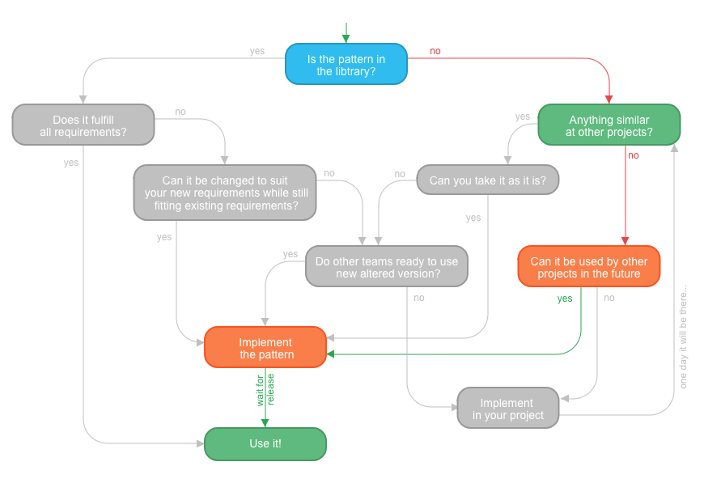
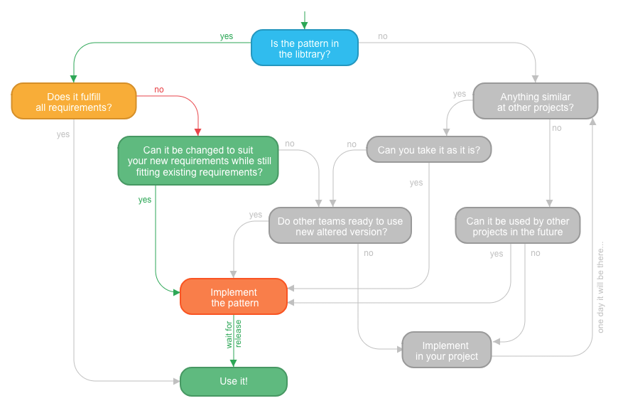

Design System artifacts whether it is a library of components, UI kit in Sketch, description of UI tokens or pieces of
documentation for the visual language are maintained and developed similarly to regular products. However, usually,
there is a difference. A design system bridges the gap between disciplines and between the teams across the organization, so
it requires involvement of all those stakeholders and their mutual contribution. To make this the most successful, a
Design System needs transparent processes and tools communicating these processes to all the people involved.

According to a research I made in several organizations,
the lack of information is the most painful point for
the usual Design System users. Even well-documented Design Systems face this problem. Often a potential design-system
contributor does not have a focus on Design Systems as a concept and experience in maintaining the
libraries. At the same time, these representatives of the projects using Design Systems are the most important people to
be involved. Developing the actual projects, they have the most knowledge about the business needs of the company
applications and are much more connected to the users than abstract design-system developers. Making these people
smoothly contribute to the Design System ensures its coverage, actuality, and instant expanding as well as saves the
resources. This can be achieved with a very detailed guidance not only for the technical or design aspects of the Design
System but also for its processes.

To start contribution, it is crucial to have a clear vision what to do in specific situations and have a support for
making decisions. This aspect is being actively discussed in the community and some offer their solutions, for example,
Brad Frost presents a decision tree:

 
Source: "Maintaining Design Systems" http://atomicdesign.bradfrost.com/chapter-5/

Below, I show an altered version in a form of an interactive component. This is a visual illustration of what happens to a
pattern on its way from identifying the need to actual implementation and how different the path might be depending on the
situation.
This process is called **Pattern Journey**.

## Pattern Journey - Interactive Scheme

The scheme shows possible paths from identifying the need in a pattern to implementing it. Answers to the displayed questions help to
choose the right way. Note that **you can click on the questions** to get additional guidance on how to get the answer.
For a specific project, the instructions can be more detailed and contain links to communication channels, pages of
documentation, repositories, Abstract spaces or Dropbox.

In the video, you can see how it works.

<iframe width="560" height="315" src="https://www.youtube.com/embed/kKnTN3EswnU" frameborder="0" allow="autoplay; encrypted-media" allowfullscreen></iframe>

## Examples of paths through Pattern Journey

The patterns make different journeys if it is a completely new UI element, changing or expending the existing one or
migrating from a project to the library. Let me show you some (but not all situations). In each of them, a potential
contributor starts from the top of the scheme and goes further navigated with the questions and answers to them. The
additional text is what they see in the popup when they are wondering how they should find an answer to the questions.

### Implementing a new component

Takes steps are:

#### 1. Is the pattern in the library?

You can search for patterns at the <i>Design System / Pattern Libarary website</i>.
Figure out what could be a name or a keyword for the pattern you are looking for, and use if in the website search.

If you don't find anything suitable, you can also ask other people in the
<i>instant communication channels</i> like Slack / Flowdock / Mattermost etc.

Answer: _No. There is no pattern in the library._

#### 2. Anything similar at other projects?

Ask around if people at other projects implement anything similar. You can instantly ask in the
instant communication channels (Slack, Flowdock, etc)
or raise this quesion in regular Design or Develoment meetings. Also, you can ask people directly.

Answer: _No. I could not find anything similar._

#### 3. Can it be used by other projects in the future?

Is there future need for such component at other projects? Discuss this with the other teams, and
do this publically in the
communication channels (Slack, Flowdock, etc).
You can also ask people directly or raise this question at regular cross-company Design or Development meetings.

Answer: _Yes. There are at least two more teams interested in the pattern._

#### 4. Implement the pattern

It seems that you need to add this pattern into the
Design System / Pattern Library.
To start with process, usually you need to create a ticket in the task tracker system
(JIRA, Trello, etc) and/or communicate about what you are going to do directly to the people.
Follow the workflow for implementing new patterns which usually includes task flow, communication standards and code style.

_Wait for release_

#### 5. Use it

Your desired pattern is already a part of the Design System / Pattern Library. Check the
<i>Design System / Pattern Library website</i>
for its documentation.
Use the component as it is documented. If you have question, do not hesitate to ask in the
instant communication channels (Slack, Flowdock, etc).
The suggestions and pull requests for the documentation improvement are very welcome.

### Taking the pattern from another project

#### 1. Is the pattern in the library?

Answer: _No. There is no pattern in the library._

#### 2. Anything similar at other projects?

Answer: _Yes. The is similar pattern at other project._

#### 3. Can you take it as it is?

Can you borrow the code of this component and use it without any change? So that both you and the "donor" project would
be using the same code?

Answer: _No. It is similar to what I need but I have to alter it._

#### 4. Do other teams ready to use new altered version?

If you change the existing component so that it meets your requirements,
are the current users of it able to use the altered version?
Ask them directly or raise this question publically. As usual,
you can communicate in the
communication channels (Slack, Flowdock, etc).

Answer: _Yes. They are happy with my changes._

#### 5. Implement the pattern

_Wait for release_

#### 6. Use it

### Fix existing pattern

#### 1. Is the pattern in the library?

Answer: _Yes. I found its documenttaion and examples._

#### 2. Does it fulfill all the requirements?

Study the pattern documentation at the
<i>Design System / Pattern Library website</i>
and all the examples provided. This way, you can understand if the pattern is suitable
for your specific task.

If there is no example covering your case, but you suppose that it is still possible
without changing its code, play around with example HTML. For confirmation, ask in the
people in communication channels (Slack, Flowdock, etc)
if the pattern examples can be extended with your case. If they can, it would be nice if you
make a pull request illustrating your specific usage.

Answer: _No. It is close what I need but I need extended functionality._

#### 3. Can it be changed to suit your new requirements while still fitting existing requirements?

Figure out the requirements for the existing component based on the documentation and examples. If you have doubts, ask in the
instant communication channels (Slack, Flowdock, etc), at regular meetings
or in person.

Does it look that you can provide changes and the component will not be broken in the places it is used now?

Answer: _Yes. I can provide changes, and nothing will be broken._

#### 4. Implement the pattern

_Wait for release_

## Usage

This decision helper is meant to be a part of a Design System documentation. Being a React component it can be easily
altered due to the needs of a specific company or product. Similarly, it can be constantly updated while the processes
in the Design System are changed and shapen.
