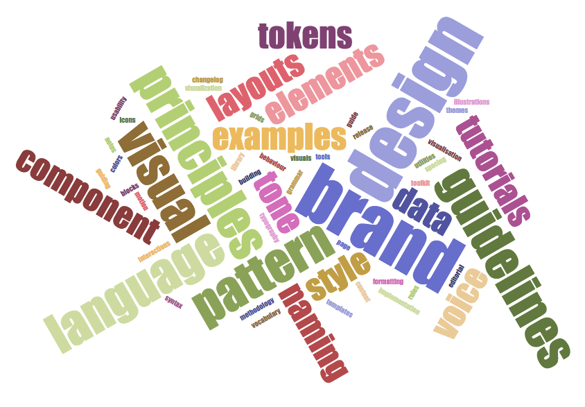

Let's start with a story.

<i>

Recently, I was talking about design systems infrastructure at awespme React Finland conference. The day before the
conference, there was a traditional dinner for speakers. I like this tradition, it makes possible for us speakers to
know each other and the conference organizers so that the next days we work as a team to provide very best event. As
usual, we were asking each other what the talks are about. When it was my turn, I started to explain that my talk is
going to be about building infrastructure for a design system and particularly a design system website. One person
interrupted me with a question "A style guide?". And that is the key issue. Many people think that **design system** is
equal to **style guide**. But it is much more, it must be much more. On this page, I show what is a design system from
different perspectives: design, development, project and even business.

</i>

## What is a design system for me?

We can have a look on who are the actual or potential users of a design system, and what are their professional needs in
this context.

<comp-project-roles role="developer"></comp-project-roles>
<comp-project-roles role="designer"></comp-project-roles>
<comp-project-roles role="owner"></comp-project-roles>
<comp-project-roles role="business"></comp-project-roles>
