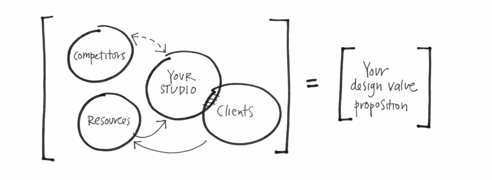

The examples of great business models are rarely static but most often those that demonstrate changes responding to the
market and competition challenges. As we cannot foresee the future, it is not possible to design a static business model
once and forever. Thus, to achieve and keep their business success, companies need ongoing innovative activity.

 
Image source:
[https://designbusinesscouncil.com/workshops/building-a-business-model/](https://designbusinesscouncil.com/workshops/building-a-business-model/)

To apply the concept of business models to the innovation domain, first, we need to understand what they are. Business
models can be seen from different perspectives. In their Critical Assignment, Massa, Tucci and Afuah outline 3 of such
perspectives: “business models as attributes of real firms, business models as cognitive/linguistic schemas, and
business models as formal conceptual representations of how a business functions” _(Massa, Tucci and Afuah, 2016)_. And
all the three interpretations can be used for innovation.

By their volume, the innovations can be divided into radical and incremental. Radical innovations are most likely
expensive and risky whereas incremental innovations are attributes of existing and most likely large businesses.
Applying business model to the process of innovation helps with both.

Speaking about radical innovations, most likely in the situation of launching a new startup, the entrepreneurs can
consider business models as attributes of real firms and compare the models of different industries. Such comparison
“may provide new insights and foster business model innovation” _(Osterwalder, 2005)_. While doing so, they will need a
language to share. This is an area where business model “linguistic schema” aspect helps. Linguistic schema works as a
communication tool bringing people together, increasing the level of mutual understanding and contributing to their
ability to produce new values, which is exactly the final goal. Finally, a well-structured description of the upcoming
business, possibly having a graphical representation, opens new ideation opportunities and resonated with design
thinking principles. By the design thinking, ideation should be “cycle of solving problems which starts from
empathizing, is followed by ideation and making a prototype with the next testing and implementing”. _(Brown, 2008)_
Business models as formal conceptual representation is a tool to be used in such innovative process.

 
Image source:
[http://blog.business-model-innovation.com/2015/06/product-is-not-the-value-proposition/](http://blog.business-model-innovation.com/2015/06/product-is-not-the-value-proposition/)

For the incremental innovations, most likely desired in larger organizations, all the three representations play similar
roles.

Given the size of an organization, any dramatic change becomes too risky and also impossible to perform assuming its
cost. Business models as conceptual descriptions, however, provide a tool for simulation and testing the innovative
ideas. According to Osterwalder, “the business model concept can help foster innovation and increase readiness for the
future through business model portfolios and simulation” _(Osterwalder, 2005)_. In other words, the innovative impact can
be split into iterations, which of those can be analyzed through the business model frameworks and tools before the
actual implementation. Besides such approach decreases the level of uncertainty, it also allows lean methods. While
working on these innovative changes, the team would need to communicate and this requires a good communication tool,
which is a business model as a linguistic schema. As in the other fields where people act in the environments with some
level of uncertainty, shared language is a crucial part of success.

Both radical and incremental innovations can be seen in three different types depending on what exactly they change
_(Amit and Zott, 2012)_:

- “content”: innovation happened by adding new activities,
- “structure”: innovation in linking activities in a new way,
- “governance”: innovation happened by changing the roles of parties.

New activities refer to something different the company does. For example, Finnish “Posti” is actively innovating this
way providing services barely associated with their main area, such as mowing lawns. Or Russian Yandex provided a taxi
aggregation service (similar to Uber), which by the time of its appearance was not at all coherent to the company main
area (Internet search) but soon became profitable and formed an independent business department. These changes
illustrate that “the main objective of business model innovation will thus be to tap into complementary assets of new
partners to create a unique value proposition.” _(Bohnsack, Pinkse, and Kolk, 2014)_ In both examples, the end customers
are now able to get new services.

Innovation which provides changes into linking the activities contributes to the structure of an activity system. For
instance, Booking.com links the hotels and their customers in a way which is different to how they previously were linked
via travel operators. Similarly, Uber links drivers and riders. Or another Russian company SkyEng which links English
language tutors and people interested in improving their language skills. There is no open information about how SkyEng
came up with their business idea, but it is clearly made by analogy with the linking businesses of other domains. When
analyzing the core aspects of such companies, business models are needed to articulate the key parts and grasp the
ideas.

Innovation which changes the roles of the parties redefines who performs the activity, in other words, changes the
governance of the activity system. Various social networks such as Facebook, Twitter, Instagram and many others, work as
a perfect example here. Similarly to the newspapers and magazines, they monetize through advertisements which they place
among their main content. But one of the social networks’ innovation aspect was that this content is generated by
different actors. In the newspaper's case, they were the professional journalists required salary or fee whereas social
networks get their content from the users for free and in enormous quantity. These are the examples of two-sided markets
where the value is provided to both B2C and B2B sides. Business models can be applied to describing these platforms and
so provide a simplified representation which is possible to study, explore in dynamics and iteratively change.

## References

Chesbrough, H. (2007). Business model innovation: it's not just about technology anymore. Strategy & leadership, 35(6),
12-17.

Amit, R., & Zott, C. (2012). Creating value through business model innovation. MIT Sloan Management Review, 53(3), 4.

Bohnsack, R. & Pinkse, J. & Kolk, A. (2014) Business models for sustainable technologies: Exploring business model
evolution in the case of electric vehicles. Research Policy, Elsevier, 2014, 43 (2), pp.284-300

Brown, T. (2008). Design Thinking. Harvard Business Review (June, 2008), 85-92.

Massa, L., Tucci, C., & Afuah, A. (2016). A critical assessment of business model research. Academy of Management
Annals, annals-2014.

Osterwalder, A. (2005) Clarifying Business Models: Origins, Present, and Future of the Concept. Communications of the
Association for Information Systems (Volume 16, 2005) 1-25.
