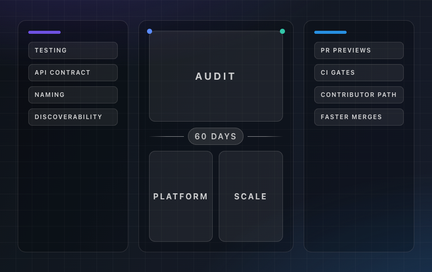

You've probably seen it yourself. A design system looks gorgeous in Figma but is an absolute nightmare to use in code. Because they have "design" in the name, design systems usually sit at an awkward organizational boundary. They get staffed with design-leaning roles and are measured by design-centric metrics like component library completeness or Figma coverage.

But if you maintain a design system at scale, you know the truth. The actual day-to-day work is engineering. You deal with dependency management, API design, testing strategies, CI/CD, and developer experience.

This misclassification leads to predictable problems. Engineering concerns like test coverage and build performance are deprioritized because they do not feel like design system work. The system accumulates engineering debt. Product engineers start seeing the design system as a black box maintained by the design team rather than shared infrastructure they can contribute to.

If you want to make a design system reliable, fast, and contributor-friendly, you need to apply engineering platform thinking.

## Symptoms of a Design System Without Engineering Rigor

What does a design system look like without engineering rigor? The symptoms are easy to spot:

* **Testing gaps.** Components have minimal or no automated tests. Visual regression testing covers only a few components, and accessibility is checked manually and inconsistently.
* **Structural sprawl.** Tests live in a separate folder far from components. Stories are in their own directory. Finding all the files related to a single component requires navigating multiple folders.
* **Naming drift.** The button in Figma is called PrimaryAction in code. The card component in code has props called variant while designers refer to emphasis. Every conversation between design and engineering requires a mental translation layer.
* **API inconsistency.** Similar components have different prop interfaces. One component uses size="sm" while another uses isCompact. There is no standard for how variants and states map to props.
* **Invisible changes.** There is no way for non-engineers to see what a pull request changes visually. Design review happens after merge based on screenshots pasted into tickets. Rework is common.

All of this creates contribution friction. Changing a component requires understanding undocumented conventions, running a local Storybook, and hoping you covered the right test cases. Product teams avoid contributing. They either wait for the bottlenecked design system team or bypass the system entirely.

## The Platform Engineering Lens

Platform engineering is about building internal infrastructure that makes other teams more productive. A design system is exactly this. It is a UI platform.

Think about how we build internal tools. A platform without tests is a platform nobody trusts. Test coverage is not just a nice-to-have for your buttons and dropdowns. It is the foundation of deployment confidence.

Platform codebases keep related code together because discoverability depends on it. When you co-locate your tests, stories, and components in one place, you stop hunting for files.

Every change to the platform should be validated automatically. Stories should build, accessibility should be checked, and visual diffs should be generated before merge. Internal platforms often provide staging environments. For a design system, this is Storybook deployed per pull request.

A platform API is its contract with consumers. Naming and prop interfaces must be intentional and aligned with what designers and engineers expect. You also need observability to know which components are used and where. If contributing is hard, people will not contribute. The path from wanting to change a component to getting it live is purely a developer experience problem.

## A 60-Day Case Study

Assume you have a design system with shared components used across multiple product teams. It works but has the symptoms described above.

Transforming your system in 60 days requires a systematic approach. Before changing a single line of code, you need to do audit which helps to identify challenges such as gaps in test coverage and API consistency. Once you know the gaps, you can build a real platform layer. For example, PR previews can be on the next level when every pull request automatically generates a Storybook link for a preview. This shifts the workflow so that a reviewer start seeing exactly what changed.

Start your first ten days by defining the platform contract. Decide what a production-grade component looks like. This usually means co-located files, a full story contract covering all states, naming that matches design tools, and a CI pipeline that builds stories and runs checks. Prioritize your top 20 most used components.

Spend the next twenty days building the platform layer. Take a few pilot components and bring them to the new standard. Invest in tooling like a story template, a CI pipeline with accessibility checks, and pull request previews. Add designers as reviewers on UI-impacting changes. The CI posts a preview link automatically, so there is no context switching. Reconcile prop names with design terminology.

In the final thirty days, scale and harden the system. Migrate the rest of your top 20 components. Apply the validated pattern systematically. Set up CI gates so new components must include stories and pass checks to prevent regression. Update your contribution guidelines to reflect the new standard and make the path explicit.

Track your metrics and make them visible. You want to monitor story coverage, accessibility violations, visual regression pass rates, and time from pull request open to merge. Communicate the faster cycle time to product teams. The design system shifts from a request-and-wait model to a contribute-and-merge model.

## Why This Framing Matters

When you think of a design system as a design deliverable, polishing means making the components look right. When you think of it as an engineering platform, polishing means making the system trustworthy, observable, and contributor-friendly.

This second framing leads to better engineering outcomes:

* Tests catch regressions before users do.
* Previews catch design issues before merge.
* Naming alignment reduces miscommunication cost.
* API consistency reduces the consumer learning curve.

It also changes how the work is valued. Engineering leadership understands platform investment. Improving test coverage, CI pipelines, and contribution velocity is a language they speak.

## Infrastructure You Can See

Design systems are unusual infrastructure because their output is visible. Every component renders pixels. This visibility is a superpower. It means you can show stakeholders exactly what changed through preview links and visual regression reports.

But visibility does not happen automatically. It requires engineering investment. The 60-day plan is a starting point. The lasting value is the shift in how the team thinks about the system. It is not a component library to fill. It is engineering infrastructure to operate.

--- 

If any of these resonate with challenges you're facing, let's chat. What upgrade would move the needle most for your system? Drop me a message on LinkedIn or even book a video call here https://varya.me/contact/