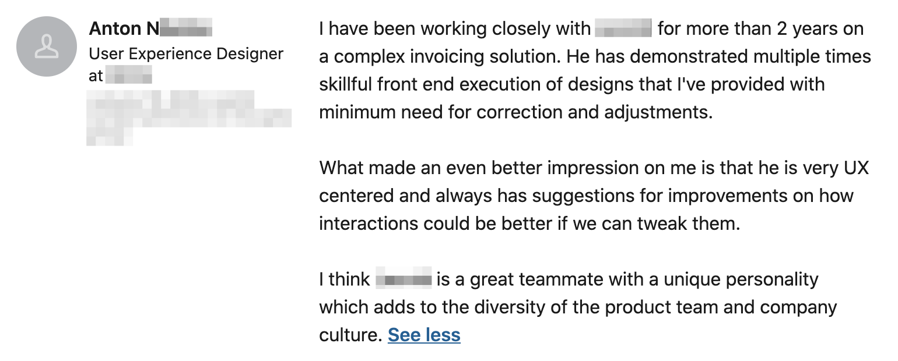

Both User Centered Design (UCD) and Agile Software Development (ASD) are widely used methods in the production of user interfaces (UI). However, they “frequently putting contradictory demands on people working with the respective processes” (Jones, 2019). Trying to match different disciplines, the designers and developers are supposed to conduct alignment work which brings them to mutual understanding in the context of their work, revealing “design breakdowns” (Maudet, Leiva, Beaudouin-Lafon & Mackay 2017) early enough.

This research aims to find what designers and developers who consider their collaboration process as successful value in each other.

### Research design

To obtain data of what is designers’ and developers’ perceptions of working with each other, the researcher collected recommendations from LinkedIn profiles. For the final data analysis, there were selected profiles of _7 designers_ and _9 developers_. The recommendations were filtered so that for developers it was only recommendations from designers (and not from people with other roles), and for designers it was only recommendations from developers. The roles of the people were taken as they identify themselves in their LinkedIn Profiles.

