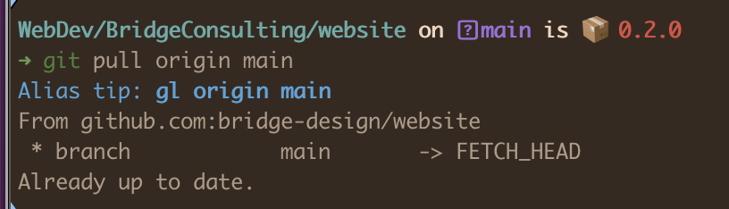
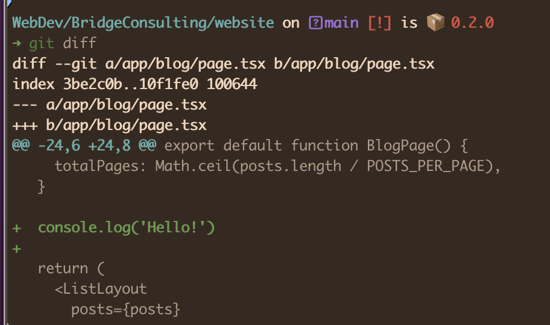

When it comes to setting up a development environment, everyone has their own preferences and tools. Recently, I embarked on a quest to refine my setup, and it turned out to be quite an enlightening journey. I sought advice from different sources, including fellow developers and AI assistants like ChatGPT. Here''s a summary of what I found and how I set up my current development environment.

## Asking Around

I began by asking various developer channels about their configurations. The responses varied widely. Some developers prefer minimal setups with essential scripts, while others use specialized tools for more elaborate setups.

Many users grow their configurations organically on a per-machine basis. Tools like Dotbot and Ansible were frequently mentioned for facilitating quick setups. There was also a strong emphasis on shell history management and tool versioning through [asdf](https://asdf-vm.com/). Most users store their dotfiles on GitHub for easy synchronization and versioning.

Interestingly, most people I talked to preferred other shell customizations instead of default one:

- **Zsh**: This was the most popular shell, often used with frameworks like [Oh My Zsh](https://ohmyz.sh/) and [Powerlevel10k](https://github.com/romkatv/powerlevel10k) for enhanced functionality and aesthetics.
- **Fish**: Some users favored [Fish](https://fishshell.com/) for its out-of-the-box usability.

To automate the setup of dotfiles and configurations, tools like [Dotbot](https://github.com/anishathalye/dotbot), [Chezmoi](https://www.chezmoi.io/), and [Ansible](https://www.ansible.com/) were highlighted:

- [**Dotbot**](https://github.com/anishathalye/dotbot): Often used for automating the installation of dotfiles.
- [**Ansible**](https://www.ansible.com/): Used for more complex setups where multiple configurations need managing across various systems.
- [**Chezmoi**](https://www.chezmoi.io/): Considered for managing dotfiles across multiple machines.

[**Oh My Zsh**](https://ohmyz.sh/) came up several times, recommended for its plugins and ease of use. Some users also preferred using [Warp terminal](https://www.warp.dev/) combined with Oh My Zsh.

## Consulting AI: ChatGPT’s Recommendations

Modern problems require modern solutions, so I asked ChatGPT to recommend open-sourced setups, especially those by frontend engineers. I preferred such focus in hope that it is more relevant for my day-to-day work. Here are the suggestions I got:

- [Mathias Bynens’ dotfiles](https://github.com/mathiasbynens/dotfiles)
- [Paul Irish’s dotfiles](https://github.com/paulirish/dotfiles)
- [Dries Vints’ dotfiles](https://github.com/driesvints/dotfiles)

All these setups have garnered significant attention on GitHub. However, Mathias’ and Paul’s setups seemed a bit dated, as they do not use Oh My Zsh, which I consider a slight drawback.

I also asked ChatGPT for references from Russian, Ukrainian, or Belarusian developers, hoping to consider setups by the people I know personally or follow for a long time. Quite funny that initially the GPT suggested imaginary people with broken GitHub links. However, after refining my request, it recommended few links and [Denys Dovhan’s dotfiles](https://github.com/denysdovhan/dotfiles) among them. Interestingly, I had used Denys’ setup on my old laptop, though last time I checked it out was in 2020.

## Making a Choice

I revisited Denys’ dotfiles, comparing them with other recommendations. The use of Oh My Zsh and fish-like autosuggestions stood out.

The README mentioned that Denys’ setup was inspired by [Artem Sapegin’s dotfiles](https://github.com/sapegin/dotfiles). Artem's setup is actively maintained and includes installing necessary programs via the Homebrew package manager. This goes beyond terminal setup, allowing the installation of browsers, Notion app, GitHub Desktop, and more with a single command. The only missing applications were Figma and Anki, which I installed separately.

Another highlight of Artem's setup is the ["Squirrelsong" color theme](https://sapegin.me/squirrelsong/) for various applications. I installed its dark version for iTerm and VSCode. The low contrast is easy on the eyes, making screen time more comfortable.

Ultimately, I went with Denys’ dotfiles. They didn’t require special configuration, but I needed to add some parameters in `.zshlocal`:

1. `SPACESHIP_DIR_TRUNC_REPO=false`: Shows the full path to the directory in a cloned repository.
2. `SPACESHIP_PACKAGE_SHOW_PRIVATE=true`: Displays version info for private packages in the prompt.
3. `source "$HOME/.zsh/spaceship/spaceship.zsh"`: I cloned Spaceship to `~/.zsh` instead of the assumed structure, so I sourced it manually.

## Spaceship Prompt

All my tweaks revolved around the [Spaceship prompt](https://spaceship-prompt.sh/), a minimalistic, powerful, and highly customizable Zsh prompt. The fact that it's a separate, mature project signals excellent solution management.

## My Current Setup

The research took about two days, but the installation and tuning only took two hours. This included setting up all applications, not just the dotfiles. Here are the features I enjoy:

- **Oh My Zsh aliases**:
  - `-` → `cd -`
  - `md` → `mkdir -p`
  - `...` → `cd ../..`
- **Folder shortcuts**:
  - `dl` → `cd ~/Downloads`
  - `dt` → `cd ~/Desktop`
  - The other shortcuts assume that I follow the suggested directory structure and I didn’t follow this advice. So, it would make me set up my own for quick navigation to the project under development.
- **Git aliases**:
  - `git a` → `git add`
  - `git b` → `git branch`
  - `git co` → `git checkout`
  - To many other aliases, I haven’t yet used to. But thanks for the tips, I hope to get it soon. 
    
- **Customized prompt**: 
  It provides necessary information about the project and its current Git status. 
  

Exploring and setting up my development environment was a valuable experience. By combining insights from fellow developers and AI recommendations, I’ve tailored a setup that enhances my productivity and efficiency. Whether you prefer simple scripts or complex tools, there’s always a way to improve your workflow. Don't hesitate to explore different setups and find what works best for you.

### Credits

Cover photo by <a href="https://unsplash.com/@tracycodes?utm_content=creditCopyText&utm_medium=referral&utm_source=unsplash">Tracy Adams</a> on <a href="https://unsplash.com/photos/powered-on-silver-macbook-pro-near-squash-on-table-_mWreAf3b-A?utm_content=creditCopyText&utm_medium=referral&utm_source=unsplash">Unsplash</a>
