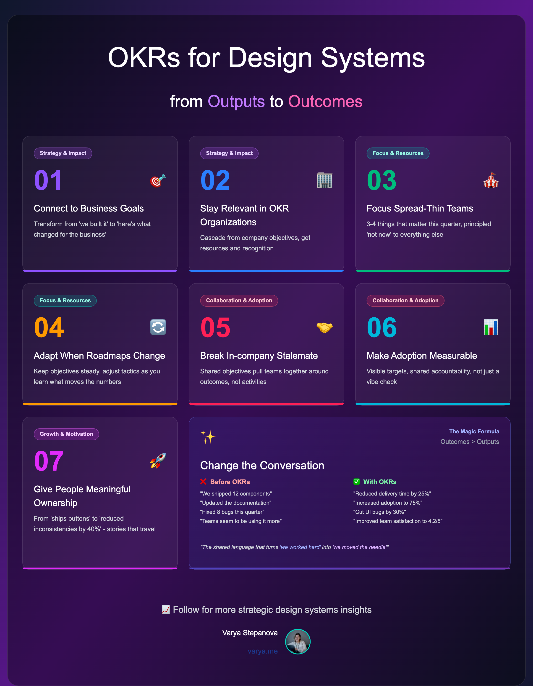

In past few years, we all have seen seen how design systems evolve from simple collections of buttons and color tokens into powerful tools that influence how entire companies develop products, foster collaboration across different disciplines, and maintain quality as they scale.

Yet, even the most talented design system teams frequently find themselves repeatedly explaining the importance of their work, handling a stream of ad-hoc requests, managing ever-shifting priorities, and struggling to demonstrate their impact beyond just announcing that they've released a new component.

If any of this resonates with your experience, then incorporating OKRs (Objectives and Key Results) into your practice can truly transform those conversations, not by introducing rigid processes to follow blindly, but by providing a clear framework that makes your intentions and outcomes crystal clear to everyone involved.

Through OKRs, teams can articulate their direction and define measurable ways to track progress toward those goals, and for design systems, this kind of clarity often marks the difference between being viewed merely as a convenient library of assets and being acknowledged as a vital strategic capability within the organization.

In this article, I'll outline why integrating OKRs into your design system practice is so valuable. It's not meant to be a step-by-step guide or a collection of templates, but rather a compelling argument for prioritizing outcomes over mere outputs, for fostering alignment instead of just activity, and for ensuring that your efforts truly make a difference in the areas that count the most.

To start, let's quickly clarify what OKRs entail and what they don't. An **Objective** represents an ambitious, qualitative goal that serves as a rallying point for your team, while **Key Results** are the specific, *measurable* indicators that show you're making progress toward that objective. **Initiatives** or **Actions**, in turn, are what you'll take to influence those results, and the real power lies not in any formal rituals, but in the common language that shifts the narrative from 'we put in a lot of effort' to 'we achieved tangible results.'

Now meet seven key reasons why OKRs can unlock the full strategic potential of a design system, grouped loosely to improve the flow, though they all interconnect and support one another. They can elevate a design system from a basic set of reusable elements into a dynamic force that speeds up product delivery, enhances user experiences, and supports the growth of everyone involved.

## Aligning with strategy and proving real impact

### Reason 1: Connect design system work to business goals

For those of us who manage design systems, one question that often arises is 'What's the ROI?'. Without a shared framework for discussing outcomes, providing a satisfying answer can be challenging. Too often, the work gets reduced to a tally of components delivered and documentation published. Instead, it should be highlighting genuine improvements in areas like customer experience, time-to-market, or overall operational efficiency. That leaves teams trapped in a cycle of reacting to immediate needs. They are still delivering valuable work, but finding it difficult to convey the broader impact.

By embracing OKRs, we compel ourselves to bridge the gap between activities and actual outcomes and encourage teams to explicitly link 'we built this' to 'here's how it benefited the business'. For instance, rather than simply aiming to 'Ship a new data table,' the focus becomes 'Reduce the time required to deliver data-heavy pages by 25% through enabling teams to adopt the new table more readily,'. This change transforms your roadmap from a mere list of deliverables into a strategic plan that enhances delivery speed, quality, and consistency in ways that directly address business priorities.

This kind of shift fundamentally alters how others perceive the value of design system work, as leaders from outside the realms of design and engineering can now clearly see what constitutes success and how it will be quantified, moving the dialogue from 'why are we investing in this?' to 'how can we accelerate this progress?', thereby building trust and facilitating better prioritization across the board.

To illustrate this more concretely:

- Objective: Accelerate product delivery for priority journeys using the design system.
- Key Result: Reduce average build time for priority UI flows by 20%.
- Key Result: Increase reuse rate of design system components in those flows from 45% to 75%.
- Key Result: Cut UI bugs in reused components per release by 30%.

The particular numbers here aren't the main point. What matters is the overall framing that emphasizes outcomes rather than just individual parts, and movement forward instead of mere activity.

### Reason 2: Stay relevant in an OKR‑driven organization

When your company already operates using OKRs, it's essential that the design system aligns with that approach rather than standing apart, as planning, resource allocation, and even recognition often revolve around these cycles. By ensuring your goals cascade from broader company and product objectives, your roadmap becomes integrated rather than isolated, positioning the system not as an optional side project but as a key lever for advancing what the business prioritizes.

This alignment helps you synchronize with leadership, integrate into quarterly planning processes, and avoid the perception of being 'the team that does nice things'. Moreover, cascading OKRs make your efforts visible and comparable to other initiatives, while also aiding in navigating trade-offs—when priorities clash, having shared metrics and targets enables quicker, more equitable decisions.

Here are some practical patterns for achieving this alignment:

- Begin with company and department Objectives, then adapt them into specific Objectives for the design system.
- Incorporate shared metrics wherever feasible, such as lead time, defect rates, adoption targets, or accessibility scores.
- Align your cadences: plan on a quarterly basis, conduct weekly reviews, and evaluate scores at the end of each quarter.

## Focus and resource management

### Reason 3: Focus a team that’s spread too thin

With design systems, there's invariably another component to develop, another team to assist, or another urgent issue to resolve, and without clear focus, the work can devolve into a polite but sluggish backlog where initiatives start but rarely finish, leading to compromised quality, dipping morale, and stalled progress overall.

By implementing OKRs, you establish boundaries around where to direct attention, compelling the team to make tough choices about the three or four priorities that genuinely matter for the quarter, and to respond with a deliberate 'not now' to everything else, which fosters a sense of real momentum. You get fewer incomplete projects, more evident advancements, and reduced burnout, as team members gain clarity on why they're tackling specific tasks and what defines success.

Here's what that focus might look like in action:

- Limit to 1–3 Objectives, each supported by 2–5 Key Results that genuinely measure outcomes.
- Maintain a publicly shared 'not now' list so stakeholders understand what's being intentionally postponed.
- Conduct time-boxed experiments to test uncertain ideas without committing the entire quarter to them.

### Reason 4: Adapt when roadmaps keep changing

Events like rebrands, the introduction of new products, or unexpected acquisitions can disrupt even the best-laid plans, and a design system that relies on annual planning while hoping for stability will inevitably feel outdated when circumstances shift, as traditional roadmaps often falter in the face of real-world changes.

Operating within OKR cycles allows to adapt without derailing the overall direction. You can keep the Objectives and Key Results consistent unless there's a fundamental shift in business strategy, while flexibly adjusting the Initiatives based on what proves effective in influencing the metrics. Additionally, incorporating mid-quarter reviews provides the opportunity to refine tactics early on, based on emerging insights, rather than making apologies after the fact, thus creating a balance of stability in purpose with flexibility in execution.

Consider this straightforward pattern:

- Maintain stability in Objectives and Key Results throughout the quarter.
- Modify Initiatives as you discover which approaches yield results.
- Hold mid-quarter reviews to make evidence-based pivots, rather than relying on opinions alone.

## Collaboration and adoption

### Reason 5: Break the in-company stalemate

It's not uncommon for design systems to provide well-crafted components that product teams overlook, opting instead to create custom solutions or even fork the system entirely. The most common reason for that are misaligned incentives and insufficient shared ownership. This situation leaved everyone occupied yet disconnected, and the users are ultimately experiencing the inconsistencies.

By establishing shared Objectives, you can draw diverse teams together, and when the design system team commits to the same outcomes as product teams, the work inherently becomes more cross-functional, redefining success from 'we completed our portion' to 'we enhanced the overall result,' thereby creating a unified definition of achievement that encompasses design, engineering, documentation, tooling, and enablement.

To support this collaboration, consider these enablers that complement OKRs effectively:

- Develop joint Objectives that necessitate contributions from both design and engineering to succeed.
- Define Key Results focused on end-to-end outcomes, such as adoption rates, defect reductions, or delivery times, rather than isolated activities.
- Establish shared practices like cross-disciplinary backlog grooming, dedicated office hours, and straightforward pathways for contributions.

### Reason 6: Make adoption measurable (and accountable)

Adoption serves as the vital pulse of any design system, yet it's frequently gauged by vague impressions like 'it seems teams are using it more,' which simply isn't sufficient. Without defined targets and collective accountability, adoption varies widely across teams, resulting in uneven user experiences, redundant efforts, and escalating maintenance expenses.

Through OKR-driven targets, adoption becomes both visible and actionable, enabling you to identify where the system is succeeding, where it's faltering, and the reasons behind it, which in turn allows for targeted enablement, resolution of obstacles, and recognition of achievements. Crucially, this approach shifts adoption from being solely the design system's responsibility to a shared commitment among product teams for the experiences they deliver.

Some valuable signals for tracking adoption include:

- The percentage of new features constructed using design system components.
- The number of teams achieving a minimum reuse threshold, such as 70% or higher in new developments.
- Time-to-adopt metrics, like the average duration from initial request to successful implementation.
- Support-related indicators, including resolved issues, documentation satisfaction levels, and contribution volumes.

## Motivation and team growth

### Reason 7: Give people meaningful ownership and a path to grow

Working on design systems can be profoundly rewarding, yet it can also feel oddly overlooked at times. When success is framed merely as 'we kept things operational,' it becomes difficult for individuals to recognize their personal impact or advance beyond their current responsibilities. As a result, we may evidence shifts to to turnover and the notion that only product-focused roles offer truly significant opportunities.

With OKRs, individuals gain concrete outcomes to take ownership of and achievements to highlight, transforming someone from 'the person responsible for buttons' into 'the individual who decreased design inconsistencies by 40%' or 'the one who halved adoption time for three separate teams,'. These narratives gain visibility throughout the organization, supporting recognition, performance reviews, and advancement discussions. Also, they cultivate transferable skills like setting bold goals, tracking progress, and articulating results.

Among the motivation enhancers that OKRs can facilitate are:

- Individual or small-team Objectives that people can lead, such as those centered on Developer Experience, Accessibility by Default, or Component Reliability.
- Regular acknowledgment of Key Result progress during demos and company-wide reviews, extending beyond simple release notes.
- Explicit connections between OKR achievements and opportunities for career development.

## Getting Started with Design System OKRs

In truth, I began this article by drawing on the OKR methodologies I've applied in several recent design system projects, but as I wrote, it became clear that the insights I've gathered could easily fill an entire book. Nevertheless, right now my aim here is to highlight the compelling reasons why other design system teams might want to explore the OKR approach, and if this has piqued your interest, here's a guide to what you can pursue next:

**Study the OKR approach in general** 
Start by building a solid understanding of the fundamentals, including how OKRs function, their historical context, and established best practices, recognizing that the framework extends beyond mere goal-setting to cultivating a culture emphasizing focus, alignment, and accountability.

**Research the frameworks that help teams come up with good OKRs** 
Various methodologies and frameworks exist to assist teams in developing effective OKRs, so investigate how other groups structure their objectives and key results, the metrics they employ, and their methods for measuring success.

**Find out what are OKRs of other design system teams** 
Not every design system team publicly shares their specific OKRs (and many are bound by NDAs). Still valuable insights can sometimes be gleaned, particularly through informal discussions with peers, as well as from case studies, conference presentations, or blog posts where experiences are recounted.

**Analyze the metrics you have or you might have** 
Since key results must be measurable, these elements are closely linked, so conduct an audit of your existing data sources to identify what's already trackable, and then pinpoint any additional metrics that may need to be established.

**Develop a dashboard tracking the metrics** 
Making progress visible is essential for OKR success, so build dashboards that transparently display advancements to both stakeholders and team members, which in turn promotes accountability and allows for celebrating milestones along the journey.

**Analyze your regular team activities in the light of whether they help tracking and operating the OKRs** 
Take a close look at your current workflows and processes to determine which activities align with and support your OKRs, and which might be serving as distractions, as this evaluation can help streamline your team's efforts and direct energy more effectively.

I'm planning to explore these topics in greater depth in upcoming articles, where I'll delve into practical strategies for implementation, common challenges to avoid, and more advanced techniques tailored specifically for design system teams.

--- 

Design systems hold tremendous potential to revolutionize how organizations develop products, but this can only be realized when their value is clearly articulated and strategically connected to overarching business goals; OKRs offer the essential framework to enable this shift, evolving design system teams from perceived cost centers into indispensable strategic contributors that generate quantifiable impact.