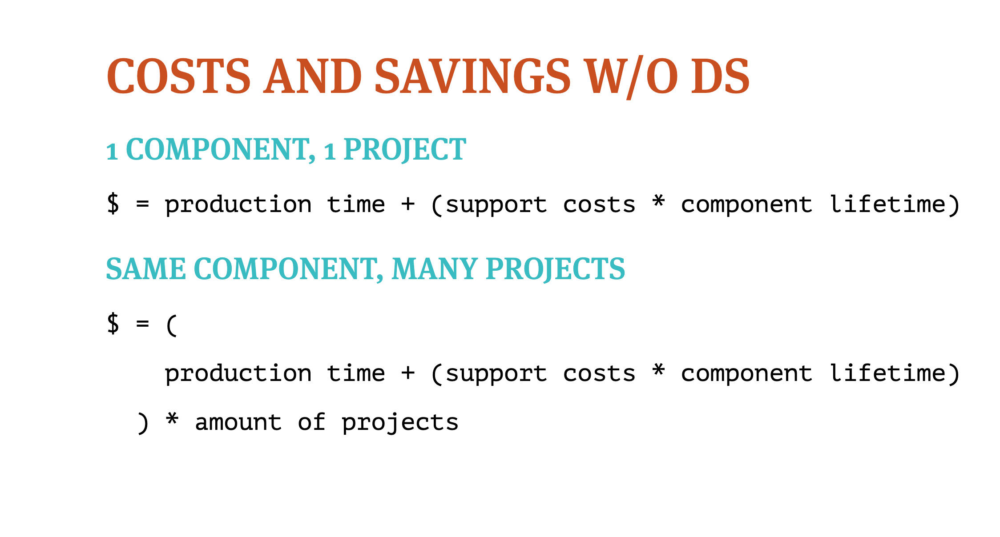
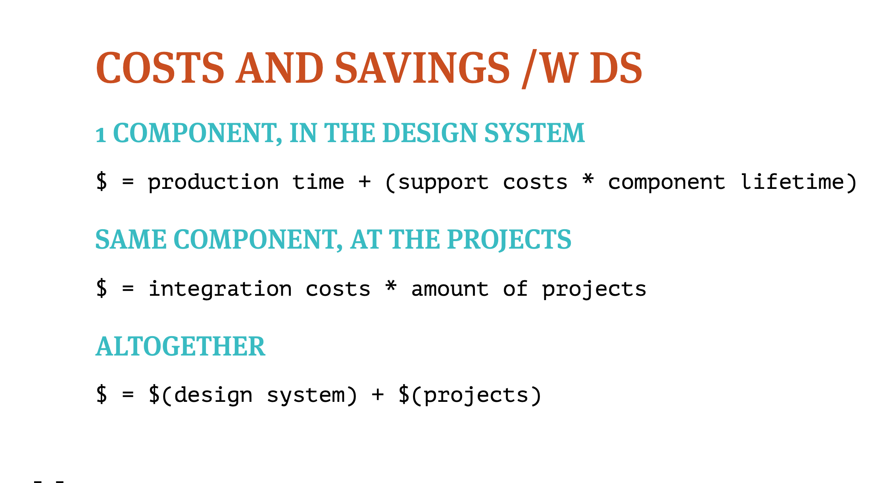
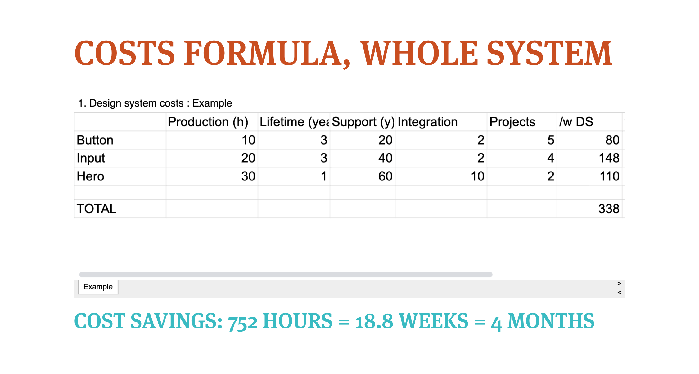
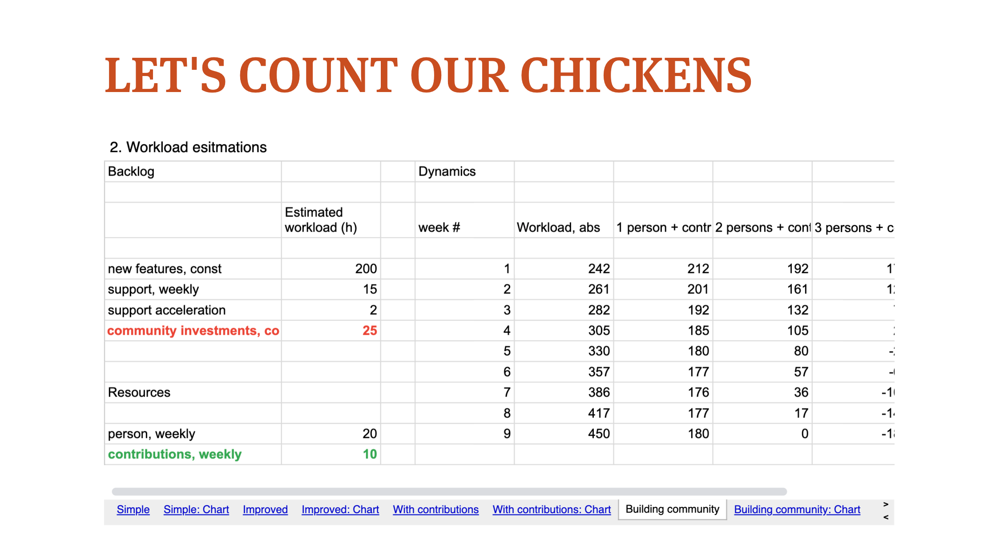
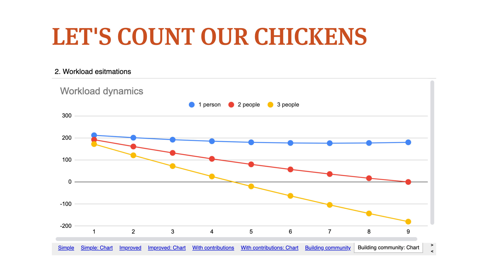
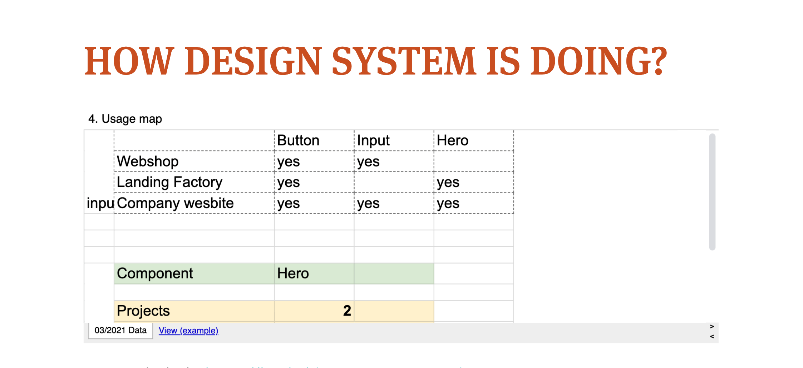
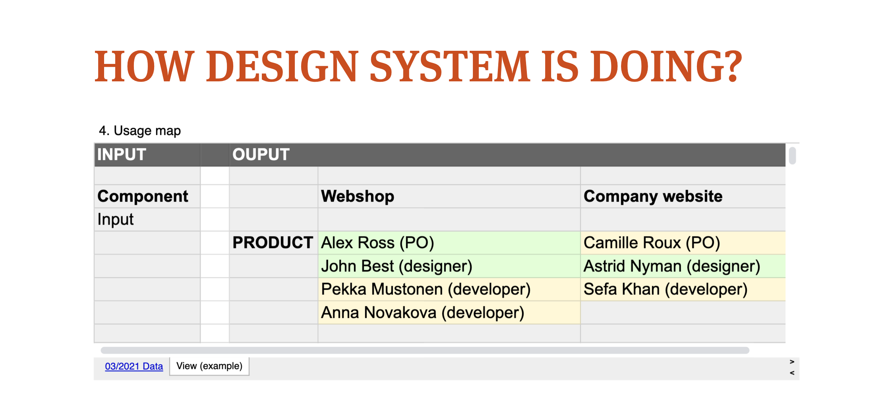
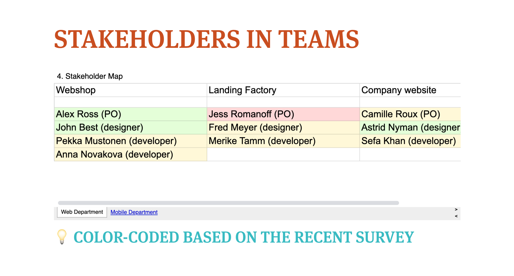

In the ever-evolving landscape of design systems, the shift from a purely technical focus to a more people-oriented approach has become increasingly apparent. This transformation, driven by the need to bridge the gap between various specialists - designers, developers, product managers, and business strategists - has led to a more holistic view of design systems. This article delves into the journey of a design system specialist, the importance of measuring design systems, and the strategies for analyzing past production costs and projecting future workloads. It further explores the role of people in boosting design systems and the use of data in managing stakeholders.

## The Journey of a Design System Specialist

As an independent consultant, front-end engineer, and engineering manager, I have been focusing on design systems for over a decade. My journey began with libraries of components before the term "design systems" even emerged. Back then, the focus was more technical, with a lot of attention paid to coding components and documenting them.

However, over time, my focus shifted. I realized that the biggest challenge was not the technical aspects but the gap between different specialists. This realization led me to pursue design education, which helped me see the bigger picture.

Today, while I still do a lot of hands-on architectural front-end work related to design systems, my role has evolved. I now focus more on engineering, project management, and educating and engaging people.

## The Importance of Measuring Design Systems

One of the key aspects of managing design systems is understanding how to measure their effectiveness. This understanding forms the basis for managerial decisions about the design system.

Unfortunately, due to non-disclosure agreements, I can't share the exact data or screenshots of the tools we use. However, I can share a story that illustrates the importance of measuring design systems.

Once upon a time, a design system team realized that their backlog was too large for them to handle. They had many great ideas but not enough resources to implement them all. So, they approached their company's financial decision-maker, asking for more resources.

The problem was not that the design system was bad or that the team was underperforming. The problem was uncertainty. Everyone in the company knew that the design system was a good thing, but no one knew exactly how much value it brought to the business. The design system team operated on feelings, not knowledge supported by data.

This story was the first push towards measuring design systems. The initial goal was to convince the decision-maker to allocate more resources to the design system team. However, it grew into something bigger, which I will introduce to you step by step.

## Analyzing the Past: Measuring Production Costs

When analyzing the past, one of the most obvious metrics to measure is production costs. In other words, how much is the design system saving us? To illustrate this, let's imagine we have a component to implement, say a button.

### The Cost of a Component

The cost of implementing a component in a single project includes both production time (designing and coding the button) and support costs (time spent on bug fixes, changes, etc.). These support costs are ongoing throughout the lifetime of the component. If we have multiple projects implementing and supporting their own versions of the same component, the costs multiply.

### The Cost of a Design System

With a design system, the costs are split differently. The same amount of resources is needed to produce the component in the design system, but the projects only pay integration costs to use the component. These integration costs are usually paid once per project. By summing up these costs, we can calculate the total cost of producing and integrating a component through a design system.

### Gathering Data

The question then arises: where do we get this data? This depends largely on your organization and projects. Here are some ideas:

- **Production Time:** This can be assessed by the design system team or obtained from a task tracker. Alternatively, you can ask people implementing the components to document their time.
- **Support Costs:** These are typically estimated. They can also be obtained from a task tracker, although this can be more complex.
- **Integration Costs:** You can ask the users of the design system how much time it takes to integrate a component from the design system. Alternatively, you can get this data from a task tracker or estimate it yourself.
- **Component Lifetime:** This can be obtained from version control (e.g., git history) or from design files.
- **Amount of Projects:** This is usually known for sure.

## Projecting the Future: Measuring the Process of Design Systems

Looking to the future, we can measure the process of design systems. If we know our workload, we can check if our resources correspond to that workload. The workload includes features we want to implement in the near future and regular routine work like bug fixing and supporting teams.

### Estimating Future Workload

How you estimate this number will depend on your organization. A good idea is to use a task tracker, which can provide data on your workload. Alternatively, you can estimate the workload based on your knowledge of the design system and its requirements.

Once you know your workload and resources, you can apply the resources to the workload and build models to see if you are managing or not.

### Example: Implementing New Features

Let's say we want to implement some new features, and we estimate that it will take 200 hours of work. We also know that the design system team spends a certain amount of time each week on tasks other than implementing new features.

By applying these numbers, we can build models to see if our resources match our workload. If the numbers don't add up, we know we need to adjust our resources or our workload.

## Projecting the Future: Adjusting Resources and Workload

When projecting the future, it's important to consider not only the workload but also the resources available. If the numbers don't add up, adjustments need to be made. This could involve increasing resources or reducing the workload.

### Support Acceleration

One factor that can increase the workload over time is support acceleration. As more features are implemented and new components are introduced, the workload organically grows. New teams and projects start using the components, reporting bugs, and asking questions, which increases the support load for the design system team.

### Contributions

Another way to increase resources is through contributions. People from other projects can help with the design system team's work. This can be achieved by investing in the community, such as running workshops, pair programming, co-designing, or improving documentation. The goal is to encourage fellow developers and designers to contribute more to the design system.

### Building Models

By using these numbers, we can set goals, build hypotheses and models, and validate these hypotheses over time. This allows us to improve our projections for the future and make better decisions about our resources and workload.

For example, let's say we have two people working on the design system team, and we're aiming to implement new features that we estimate will take 200 hours of work. We also know that the team spends 15 hours each week on support and routine work. If we add in an estimated support acceleration of two hours per week and contributions equal to five hours of work per week, we can build a model to see if our resources match our workload.

If the numbers don't add up, we can adjust our model. We could increase the level of contributions to 10 hours per week, for example. This would require an investment in the community, but it could help us meet our goal.

## Measuring the Present: Accessing Instant Data

The same data used to analyze the past and project the future can also be used to measure the present reality. This data, when instantly available, can guide us in a different direction.

### Storing and Operating Data

Different projects may use different methods to store such data, such as company wikis, internal websites, or online documentation systems. However, what worked best for business people was Excel or Google Sheets. These tools allowed them to operate with the data and potentially integrate it into their systems.

In the project I'm involved in, we use a custom script that crawls through the company's GitHub using an API. It gathers information on which components from the design system are integrated into the projects. This data is transformed into a CSV file and then imported into Excel.

### Usage Matrix

At the top of the Excel sheet, we have a usage matrix. This matrix shows which projects are using which components from the design system. For example, all projects might be using a button component, but only some are using an input or hero component.

### Tool for Data Operation

Below the usage matrix is a tool that allows us to operate with the data. We can select a component, and the tool will calculate how many projects are using that component. It provides more extended data than when we calculated the past, showing exactly which projects are using the component. This tool can be used to approach specific projects if needed.

### Using the Tool

This tool can be used in several ways. For example, if a library has critical updates for particular components, we can use the tool to identify which projects will be most affected by the update. We can warn these projects in advance or even invite them to a conversation before making the update.

We can also see if a project is not using a component and ask why. Do they need help? Do we need to change something? Or do they just need a bit of support?

The design system team can use the tool to search for contributors, as the most likely contributors would be those people that are using the components. This tool is not only useful for the design system team but also for the teams using the design system.

## People: The Key to Boosting Your Design System

While data and numbers are important, the key to boosting your design system is people. People are the source of data, the ones we aim to connect with, and the ones we need to focus on.

### Stakeholder Map

To better understand and connect with people, we can create a stakeholder map. This map can list the people involved in different projects, their roles, and other relevant information. For example, we could color-code people based on a recent satisfaction survey to see who is happy with the design system and who is not.

This stakeholder map can be linked to the tool I showed earlier, allowing us to see not only which projects are using a component but also who is involved in those projects. This gives us a tool based on reality for managing the stakeholders around the design system.

### Open Access to Tools

The tools we use, such as Excel or Google Sheets, should be open to everyone in the company. Not only can the design system team and other teams use these tools to connect, but business people and management can also use them. For example, if there is a complex functional component like a login component in the design system, a team managing the login process would be interested in who is using this component.

### Focusing on People

When we count things from the past and aim for something in the future, it brings us to the present where we again have people. We need to ask about their experiences with the design system, about integration costs, about production costs, about support costs, and about their satisfaction. We also need to ask if they can help us.

The role of people in the design system world is a mature topic with many talks and articles about it. The key to the success of a design system is people. To boost your design system, you have to focus on people. And with the calculations we've discussed, you can focus on the right people and connect with them.

## Then, what?

In conclusion, the success of a design system is not solely dependent on the technical aspects, but rather on the people who interact with it - the designers, developers, product managers, and business strategists. By focusing on people, measuring the effectiveness of design systems, and using data to guide decisions, we can significantly boost the performance and acceptance of our design systems. Tools like Excel or Google Sheets, while seemingly simple, can be incredibly powerful in managing stakeholders and providing real-time data for informed decision-making. The key takeaway is that people are at the heart of design systems. By understanding their needs, experiences, and contributions, we can create a design system that is not only technically robust but also people-oriented. As we continue to evolve and innovate in the field of design systems, this people-centric approach will undoubtedly remain a critical factor in driving success.

<small>
This article is based on the content of a video presentation and has been created to provide a summary of the key points discussed. While I have strived to present the information accurately, some details may have been condensed or simplified for readability. For a comprehensive understanding of the topics covered, I highly recommend watching the original video in its entirety: <a target="_blank" href="https://www.youtube.com/watch?v=OaqBxIp15hg">Design system: from bookkeeping to championing</a>.
</small>
