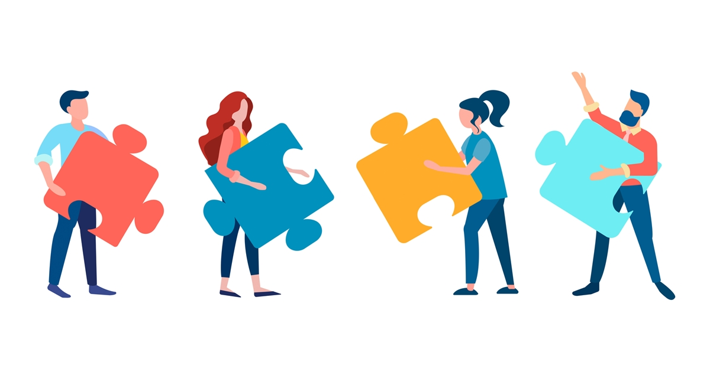
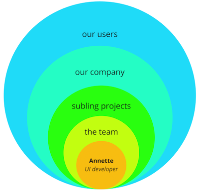
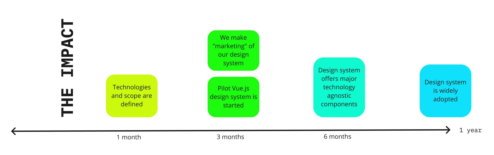
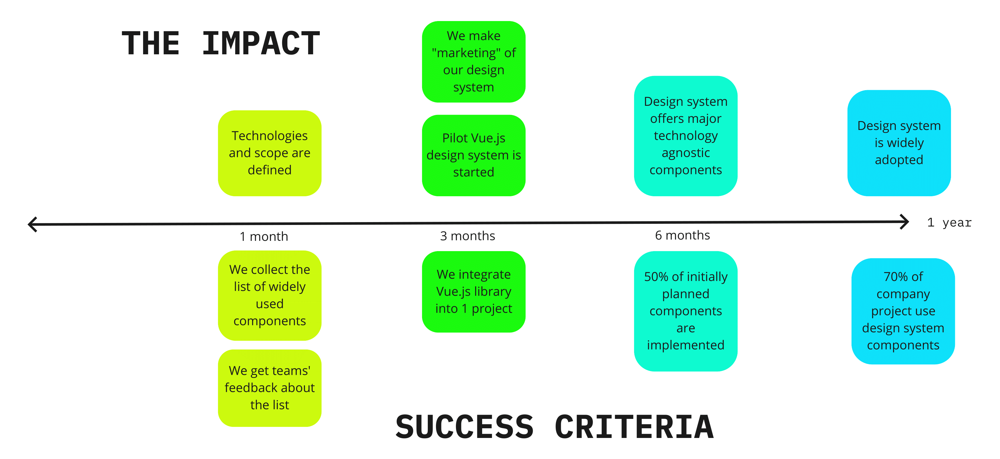
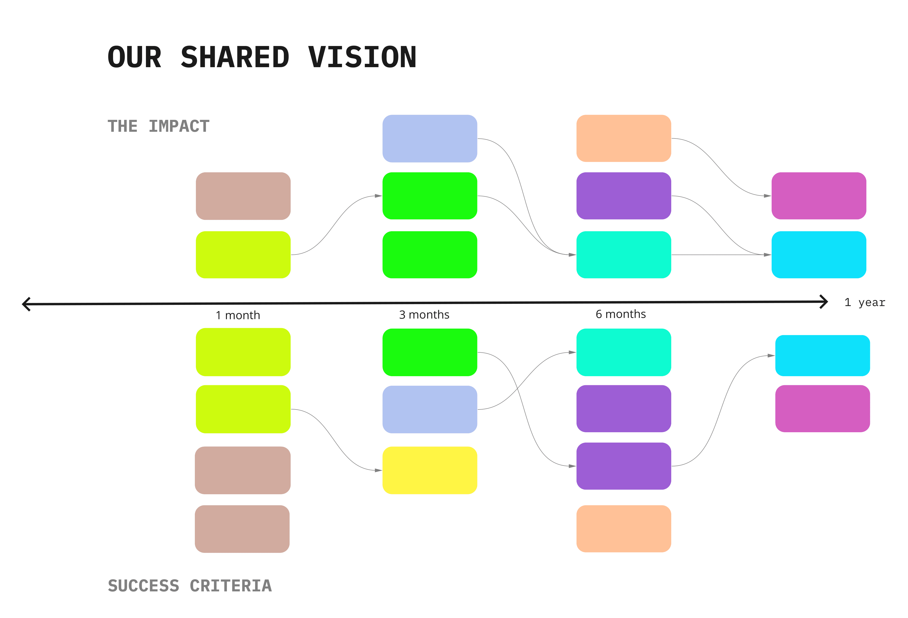

In our [design system] team, we struggled to understand what should be our main focus
for the next year. An extra challenge is that such an understanding should be mutual.
It is especially hard to gain when working remotely. Since March 2020, most companies have sucessfully put the already set processes to the remote rails. However, it is not always
the case when it comes to creating something **new**. Despite the brainstorming sessions
with interactive boards, we still act more as individuals sitting in our living rooms and basements. This is something compeletely different from the situation when the whole team
was in the same room, when we had coffee breaks, lunches and afterworks, when we were in
constant communication and each team member at least partly understood the viewpoint of
the others. The new reality requires specific actions to substitude the natural process
of getting each other. In this post, I share simple exercises we conducted with the team
that helped us on the way to shared project vision.

## Extended workshop and pair exersices

In fact, we had a traditional workshop with some taks and interactive whiteboards
to complete them. But we made it extended in time, and this had a special meaning.

Our team is 4 people, and we worked on 3 exercises in pairs. Such combination made it
possible that every team member works with each and every of their fellows.

<Image caption="Image source: https://www.africanbusinessreview.co.za/the-best-outdoor-team-building-activities.html">

</Image>

The pair combinations were as the following:

- **Exercise 1**: Rose & Sean; Yves & Nicole
- **Exercise 2**: Rose & Yves; Sean & Nicole
- **Exercise 3**: Yves & Sean; Rose & Nicole

The task: _In all the exercises: think about the (sub)project you are committing as a member of a [design system] team. What are your goals for the rest of 2021 and in 2022? What are you doing? What do you want to achieve?_

By the plan, each team member should have done all the exercises. Each exersice had a specific goal but in general they were similar: one of the pair shares their vision and
answers the questions while another one facilitates and writes down the outcomes.
Working in pairs helped us to focus on each other more than in our group conversations.

It was possible to run all the exersices in one session using the breakout rooms but we
had them separately on different days, and for a reason. In all the exersices each of us needed to communicate our vision. We also needed to be very specific on that because it was our pair who wrote down the outcome. It happened, and I noticed that myself, that own
understanding of the environment and the goals ahead crystalizes (sometimes even changes) when pronounced again and again. It was a good thing to sleep over with the ideas that had been just articulated, so that the next day they are more clear for its own author.

## Exercise 1. The Context Onion

Before we came to the goals, it was useful to undestand our context.

_Where are we as
individuals and our team on the organization map? Does our project belong to some
bigger strutural unit or serve larger goal? What is its environment?_

While the one was sharing their view, the other team member drew an onion diagram to reflect
the pronounced. In the outcome, we should see the whole context and also the highlighed
actions on the different levels that affect the actor and the project.

## Exercise 2. The impact we desire

Being mentally put into the right context, we managed to start thinking of what is the
impact we desire. That helps a bit to ground it down, so the next exersice was to
figure out the year goal(s) and the milestones on the way to it. While the one was
speaking on the topic, the facilitator guided them with the questions and drew a timeline with the goal that was a year ahead, and actions to complete in 6 months, 3 months and 1 month from now.

## Exercise 3. Success criteria

The last exersice didn't require much drawing as the timeline could be borrowed from the previous one. However, since the workshop schedule assumed a different pair, it still required to explain the whole picture. After that, we needed to define the success criteria
for all the steps.

_What exactly do you have to achieve in order to pronounce your "project" complete? What should be the success criteria on the go: in 6 months, in 3 months, in 1 month?_

This is also the moment when the context onion from the first exercise can help once again. _Is the success defined by you only or by the other layers too?_

## Common session. Summarise and reflect

After all the exercises, we had a common session where we finally saw all the results together. After presenting them one by one, we combined all the timelines into one, identified logical connections between some actions, and adjusted the timeframes.

It depends on the project nature and scope, if you can take the outcome as your roadmap without dramatic changes. In the case of our project — no. But the **visualised shared vision** is a huge step towards such a roadmap. It is also great help when communicating with the other stakeholders on behalf of the whole team.

The execises idea: [Facilitating change. Online Course for Change Leaders](https://medium.com/facilitating-change-2021)
