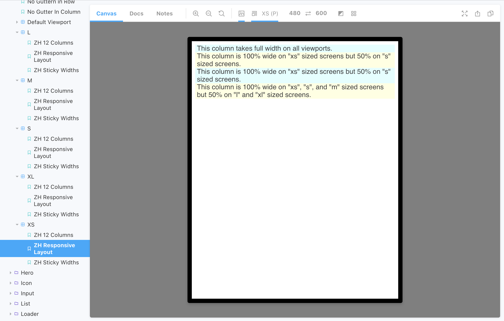

<div data-excerpt>

Making the components responsive is usually one of the key requirements for any design system or a pattern library.
This means that the documentation system has to follow and show how the components are rendered on small to large screens.
In this post, I show how I managed to do it with Storybook and get unique URLs for such responsive stories for later
embedding them as examples into other (documentation) pages.

</div>

Storybook provides essential add-ons, and one of them is for working with different screen sizes. It gives
you a viewport toolbar where you can select how to render your stories.

The [documentation page](https://storybook.js.org/docs/react/essentials/viewport) explains how to get it working
and how to configure for your specific case.

You may enjoy the default set up and manually change the viewport settings when developing or checking documentation
of the components.

However, sometimes there is a need to demonstrate how the same code is rendered on different screens. For example,
if you are writing documentation for responsive components such as a grid system. In this situation, changing the default
viewport and making generic stories can save a lot of your time.

You can write the stories once, but show them with different settings. This is how I demonstrate the grid system behavior on large and small screens:




As you can see in the sidebar, there is sub-navigation for the Grid stories. It shows the same three examples of different screen sizes. Someone who is checking the documentation on Storybook does not need to use the viewport toolbar because
each of the subfolders already shows all its stories with the defined setting.

## Set up thew viewports

If you want to do the same, first you should set up the viewports you are goint to use. This is a piece of code from
my `.storybook/preview.js` file:

```js
const customViewports = {
  xs: {
    name: "XS",
    styles: {
      width: "480px",
      height: "600px",
    },
  },
  s: {
    name: "S",
    styles: {
      width: "640px",
      height: "801px",
    },
  },
  m: {
    name: "M",
    styles: {
      width: "960px",
      height: "700px",
    },
  },
  l: {
    name: "L",
    styles: {
      width: "1200px",
      height: "800px",
    },
  },
  xl: {
    name: "XL",
    styles: {
      width: "1400px",
      height: "900px",
    },
  },
};

addParameters({
  viewport: {
    viewports: {
      ...customViewports,
    },
  },
});
```

## Write the stories

Then, you will need a file with repetitive stories. It should be written similarly to a usual `.stories.js`. But you
do not need `export default` part because these stories should not be shown. We will use them for later re-exporting. This is my `components/Grid/Grid.generic.stories.js` (I changed the content to make it shorter).

```
import React from 'react';

export const story1 = () => <Grid>Example 1</Grid>

export const story2 = () => <Grid>Example 2</Grid>

export const story3 = () => <Grid>Example 3</Grid>
```

## Re-export the stories

The generic stories can be re-used with different viewport settings. I have a separate `.stories.js` file for each of them:

- `Grid.viewport-xs.stories.js`
- `Grid.viewport-s.stories.js`
- `Grid.viewport-m.stories.js`
- `Grid.viewport-l.stories.js`
- `Grid.viewport-xl.stories.js`

The content of these files is similar but the viewport settings are different:

```

import React from 'react';

export default {
  title: 'Components/Grid/XS',
  decorators: [
    storyFn => (
      <div className="ds-storybook-grid">
        {storyFn()}
      </div>
    ),
  ],
  parameters: {
    viewport: {
      defaultViewport: 'xs'
    },
    loki: { skip: true },
  },
};

export * from './Grid.generic.stories'
```

Note the last line! `export * from './Grid.generic.stories'` re-exports all the stories. So, you need only support this
very file and you get the stories for all the viewports generated automatically.

## Why?

There are not that many situations you would need this solution. But it provides each story with a unique URL and predefined viewport size (something that the toolbar is missing). Using this URL and having your storybook publically hosted, you can
embed your stories and iframes into some other pages and be sure that they illustrate the behavior on the component
on a specific viewport.
