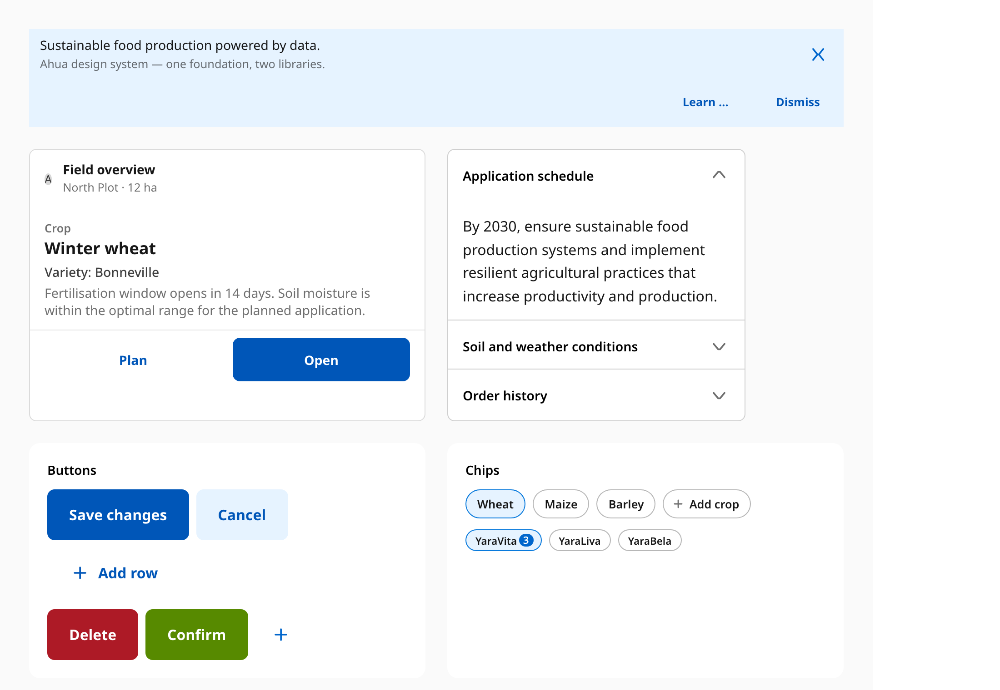
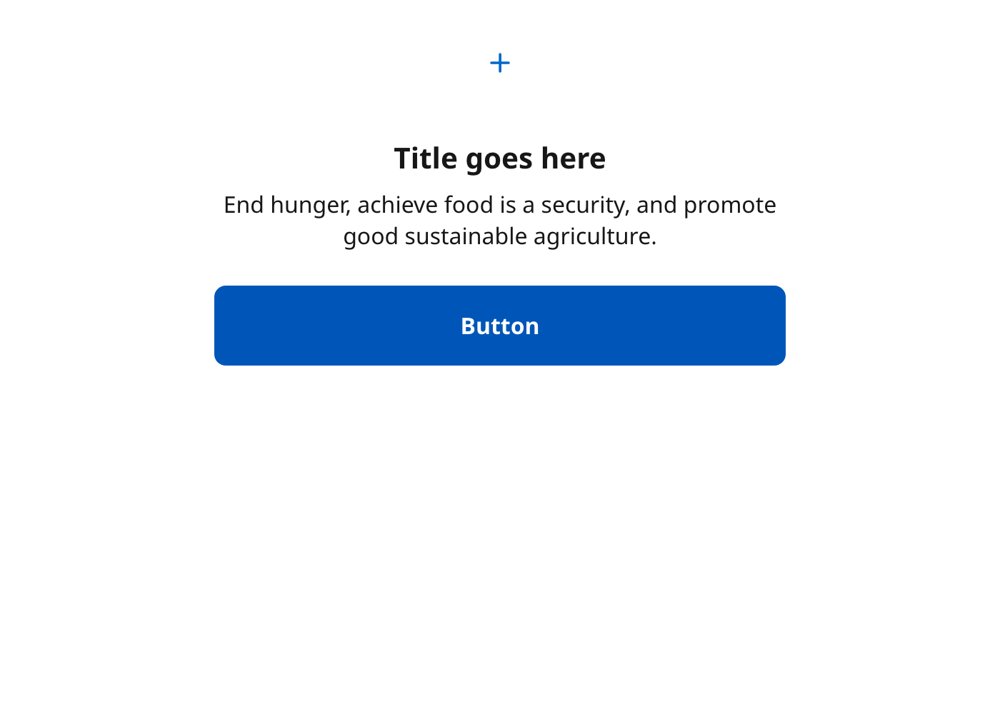
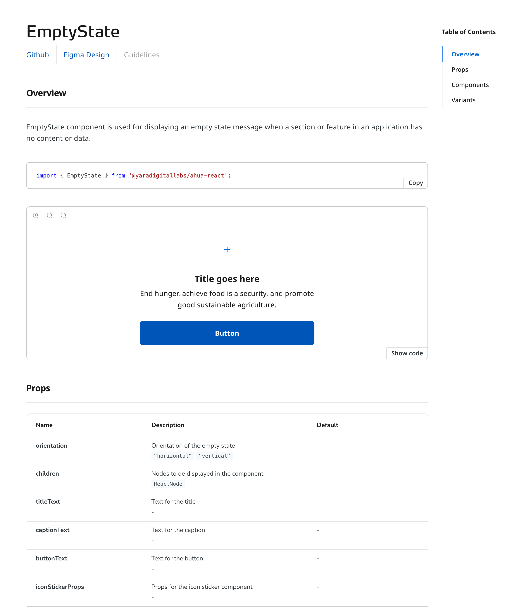
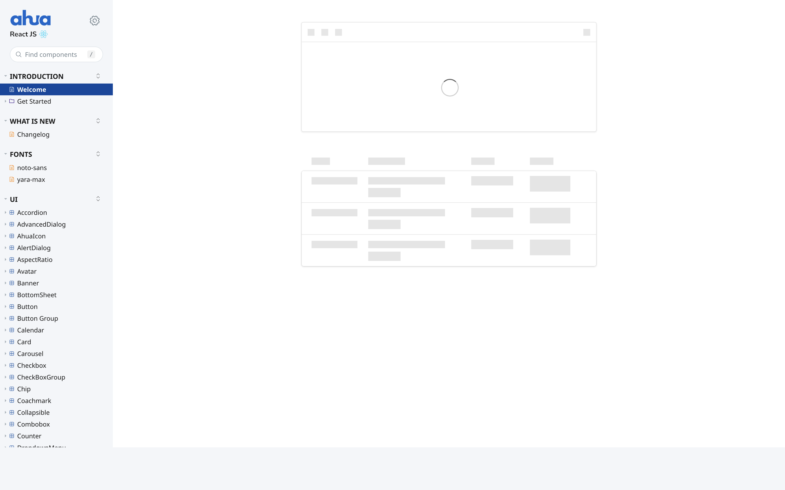
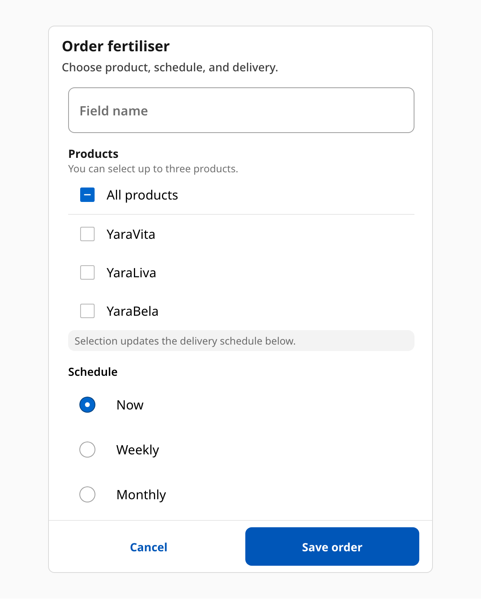
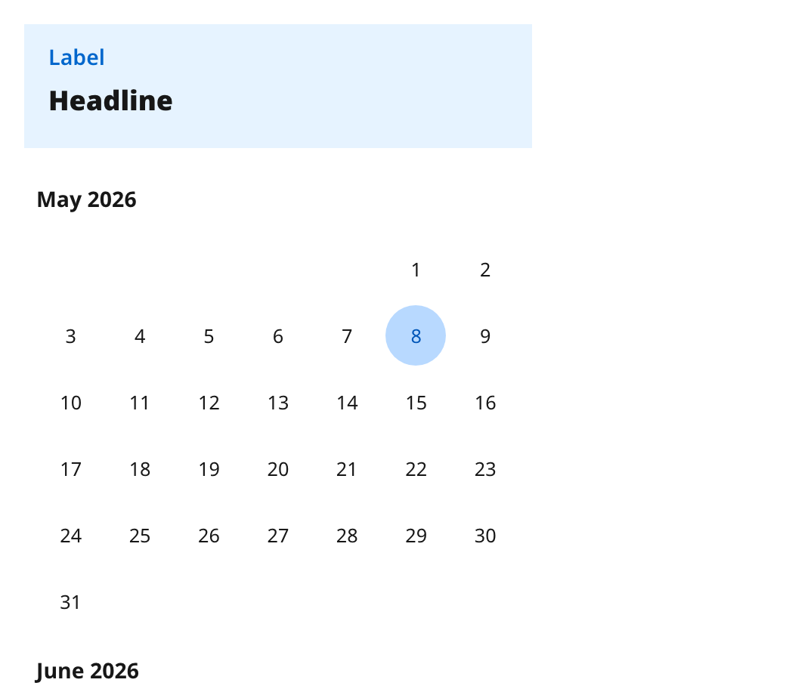
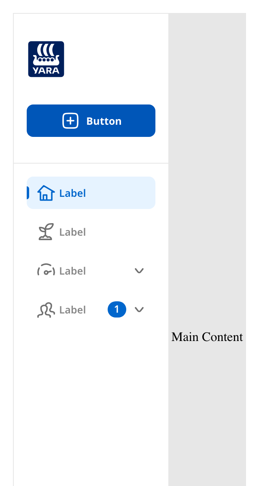
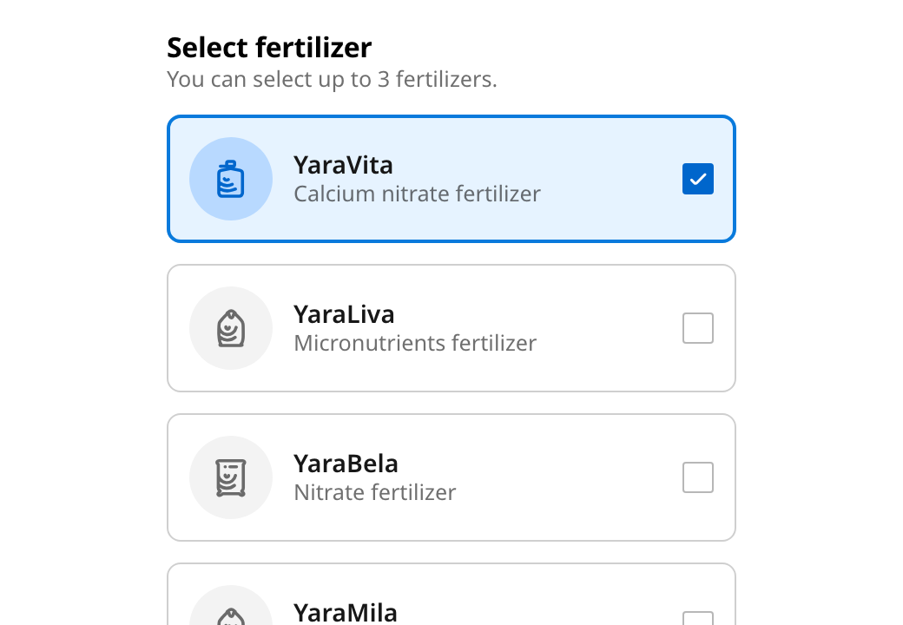
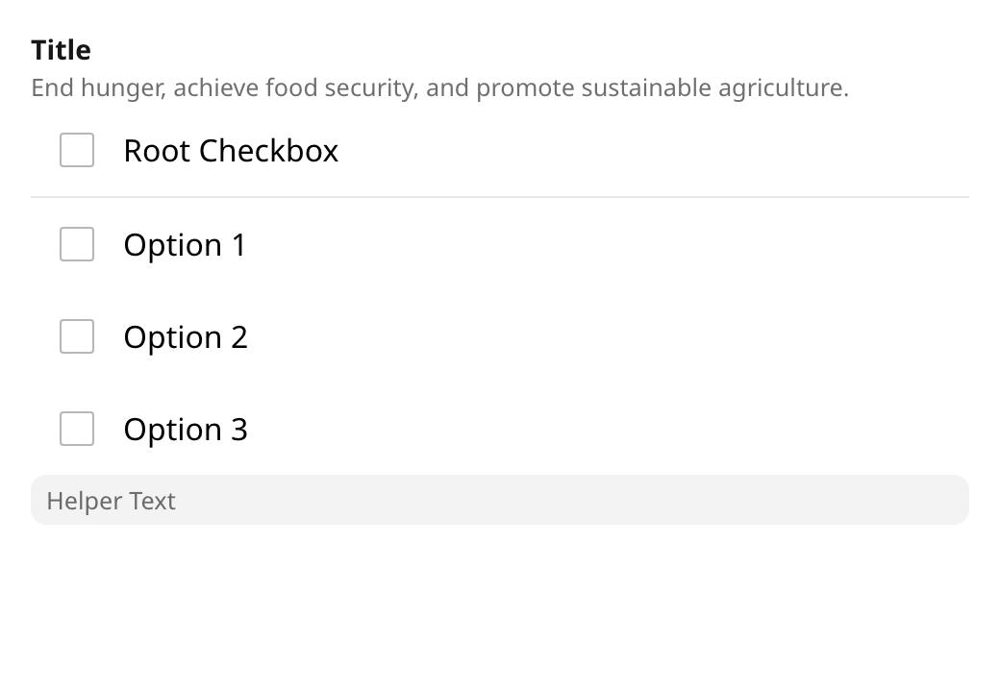

| | |
| --- | --- |
| **Company** | [Yara International](https://www.linkedin.com/company/yara/) |
| **Industry** | Industrial agriculture, AgriTech |
| **Year** | 2023 – 2024 |
| **Role** | Design System Architect & Lead Developer |
| **Team** | Bridge the Gap (my consultancy team) — four engineers including me — partnering with Yara's design-system lead, in-house designers, an in-house UX designer focused on engineer experience, in-house and consultant React Native engineers, and product engineers across multiple Yara product teams |
| **Stack** | React, React Native, TypeScript, Stitches, NX monorepo, Storybook (6 → 7), Jest, Chromatic, Detox |

## Executive summary

Yara International — the multinational crop-nutrient and digital-agriculture company — runs a multi-product UI surface on top of an internal design system called **Ahua**, shipped as two production libraries (React for web, React Native for mobile). When we joined, the system was visible to product engineers, but the developer experience was uneven: Storybook 6 with hand-authored MDX1 stories, no shared composition pattern across compound components, parallel token systems for web and React Native that drifted from each other, and a documentation surface that didn't quite reflect how product engineers actually used it.

Over six months, Bridge the Gap (my consultancy team) partnered with Yara's design-system lead, the in-house designers, the in-house UX designer, and engineers across the wider product organisation. As the design-system architect on our side, I led the technical and documentation direction across the engagement. Together with my team, we shipped 10 new components on a shared compound-component pattern, brought 20+ legacy components onto a single dotted-display-name convention, migrated both libraries from Storybook 6 to 7, and rebuilt the Storybook surface — driven by user research with Yara product engineers — into a branded, scannable documentation experience. We also designed and delivered the new tier-based token system: vocabulary, naming convention, Figma re-organisation, and the cross-library codegen plan.

The end result is a design system that product teams reach for first, that has consistent component APIs across the catalogue, and whose Storybook pages designers and engineers navigate together.

## Context — what we walked into

Ahua lives in an NX monorepo. At engagement start it housed:

- **`libs/ahua-design-system-react`** — the React web library. Stitches-based theming, ~50 components, Storybook 6 with hand-written `.stories.mdx` per component.
- **`libs/ahua-design-system-react-native`** — the React Native library. A parallel `GlobalTokens` set and a Storybook 6 setup hybridised with `@storybook/addon-react-native-web` so RN components could render in a web Storybook.
- **`libs/ahua-design-system-common`** — a tiny shared utilities package.
- **`apps/react-vite-app` / `apps/react-native-app`** — playground apps for trying components in a real React/RN context (rather than just inside Storybook).

The libraries worked, but a closer audit surfaced four recurring patterns:

- **Compound components without dotted display names.** Components like `Card.Header` rendered as plain `Header` in Storybook code snippets — Storybook reads the runtime function name, not the dotted path. Across the catalogue this was inconsistent; every doc page that showed a code snippet had to be read defensively.
- **Two parallel token sources of truth.** A change to font sizes meant editing the web's Stitches config *and* the RN's `GlobalTokens.ts` independently, with no automation to keep them aligned. Drift was already visible.
- **Storybook 6 with MDX1 stories.** Story authoring was inconsistent (`.stories.mdx` with embedded JSX), and Storybook 7 — which the wider ecosystem was moving onto — used a different story format. Without migration, the gap would only widen.
- **Documentation that didn't help product engineers.** The default Storybook chrome wasn't the surface engineers wanted to scan when they came to pick a component. Tokens and component APIs lived in formats that designers and engineers consulted in different mental models.

These weren't crises — they were the friction patterns that slow down a healthy product team. Yara's design-system lead asked us to take ownership of the foundation while their team kept shipping product.

## How we worked

### Spec-driven definition before code

I work with a method I call **ultra-defined components** — closely related to *spec-driven development*, but with a stronger emphasis on the human side of the conversation.

Before a single line of component code is written, I produce a written spec that lists everything the component does: the interface, accessibility behaviour, edge cases, and a *natural-language* test plan. The spec is then walked through together — designer, lead, and developers — until the disagreements surface and resolve *upfront*.

Two things make this method work:

1. **The spec is written for humans first.** A designer who never reads TypeScript can argue with a sentence like "the dialog closes on overlay click unless it's modal." They cannot argue with a type signature. So the discussion stays where the disagreements actually live: behaviour, not syntax.
2. **The test plan precedes implementation.** Once the spec is signed off, the test list often becomes the test file almost verbatim. The component itself is then frequently a no-op for the developer — sometimes Copilot finishes it on the first try.

I wrote up the method publicly on the Bridge the Gap blog: [Define your rock-solid design system components](https://bridge-the-gap.dev/blog/design-system-define-components/).

### Embedded across two libraries

We worked as one team across the engagement. Bridge the Gap brought four engineers (including me) for six months. On the Yara side we partnered closely with the design-system lead — who managed me directly across the engagement — the in-house designers, the in-house UX designer focused on engineer experience, and the in-house and consultant engineers shipping on the React Native side.

The libraries are independent codebases but are scoped together: every architectural decision (composition pattern, story format, custom Storybook UI, documentation pages) had to land symmetrically in both. A weekly sync held the cadence; quarterly reviews kept the bigger arc in focus.

### Sprint-end demos and a Slack changelog

We ran sprint-end demos throughout the engagement: the team would walk through what shipped, what was in review, and what the next sprint was tackling, with product engineers in the room. After each demo, I wrote a short Slack changelog — what's new, what's renamed, what's deprecated — into the design-system channel. That became the regular product-team-facing surface. Daily support stayed in Slack and on calls: a product engineer hitting friction with a component could ask, get a same-day answer, and that question often became a docs improvement or a small fix the next sprint.

### Design-system evangelism

The system is Yara's, owned in-house. My role on the BTG side was as much about making the design system *visible* across the wider Yara engineering organisation as it was about building it. I was in continuous contact with product engineers — in-house and consultant — who were adopting components, asking about coverage, or hitting the gaps that hadn't been built yet. Every Slack thread or call was a feedback channel, and that feedback fed directly into what we prioritised.

## Signature work

### EmptyState — the pilot and the composition pattern

The team's pilot component was EmptyState, shipped in two intense days at the end of August. Twenty-five commits later it set the codebase conventions used by every later compound component: composition with a `Root`, slots like `Image`, `Description`, and `Action`, an orientation prop carried through React context, and stories composed of those primitives directly so the docs page showed exactly how a consumer would assemble it.

I led EmptyState. The architectural payoff: every later compound component the team shipped — CheckBoxGroup, BottomSheet, NavigationRail, Accordion, Calendar, SelectGroup — followed the same shape. One root export, a small ecosystem of dotted sub-elements, and stories that read like consumer code.



### Storybook 6 → 7 — re-authoring every story

The defining engineering effort of the engagement. Storybook 7 isn't a dependency bump — its docs surface is auto-generated from the component's runtime, and the story format moves from MDX1 (`.stories.mdx`) to CSF3 (`.stories.tsx`). Every existing story had to be re-authored.

The migration shipped as a single mega-PR — 555 files, hundreds of thousands of lines moved — with extensive pair-review across the team. Both libraries (web and React Native) made the jump together, and the same PR introduced a small but load-bearing utility, `withDisplayNames`, that fixes a Storybook 7 problem: by default, compound components like `Card.Header` render as plain `Header` in code snippets because Storybook reads the runtime function name. The utility walks a root component's enumerable properties and assigns the dotted name on each.

I led the post-migration follow-ups: pipeline-image upgrades for CircleCI compatibility, story-type fixes for the new CSF3 format, and the long-tail standardisation work below.

### The withDisplayNames adoption sweep

Once `withDisplayNames` shipped inside the SB7 mega-PR, the rest of the catalogue had to be brought onto it. Twelve PRs over three weeks in December applied `withDisplayNames` to 20+ legacy components: Carousel, Chip, Coachmark, Dropdown, EmptyState, Image, ListItem, Snackbar, Stack, Banner, List, NavigationRail, Pagination, Table, Sidebar, AdvancedDialog, Timeline, GroupHeader, NavigationItem.

The diffs were surgical — a few imports, a swap of hand-written `displayName = '...'` boilerplate for one `withDisplayNames` call — but the visible effect was that every Storybook docs page now rendered the right component names in code snippets. From a designer scanning the docs, the system stopped *looking* like a thirty-component catalogue with thirty different naming conventions.

I led this sweep almost entirely myself. Concurrent with it, I hardened the utility's typings (three commits across three days) so the call sites stayed concise without losing type safety.


### Custom Storybook UI from user research

The Storybook chrome that product engineers see today is the result of three coordinated workstreams that ran across the last two months of the engagement. The direction came from four inputs in parallel:

- **User research with engineers.** The in-house UX designer ran research sessions with Yara product engineers about how they actually used the design-system docs. The findings drove the navigation, scanning, and on-page-component decisions.
- **Designer feedback.** Yara's design lead pushed for stronger brand presence and readability across the docs surface.
- **Doc-page best practices.** Conventions from open-source design systems we'd surveyed — table of contents, tabbed canvas, code-snippet block, jump links — informed the UI vocabulary.
- **Sprint-end demos and feedback events.** What product engineers asked for during demos got rolled directly into the next sprint's UI work.

The implementation was three coordinated PRs across the team:

- **Theme + sidebar.** A custom Storybook theme via `@storybook/theming`'s `create()`, branded sidebar header, and Yara brand fonts (six weights of YaraMaxLF) shipped via a custom font-face stylesheet. The default toolbar was hidden so the docs canvas became the primary surface.
- **Custom component-page chrome.** Nine reusable doc-page components — `component-args`, `component-description`, `component-import`, `component-links`, `component-stories`, `component-title`, `section-heading`, `styled-argtypes`, `styled-story-toolbar` — replace the default Storybook docs layout. The props table is custom; jump links to anchor-points within the page; a code-snippet import block at the top of each component page so engineers can copy the import in one click.
- **Table of contents and tabbed canvas.** Component pages expose a TOC down the right side, and multiple example variants per component live behind tabs in the Docs page rather than as separate sidebar entries.

All three landed identically in both libraries — the `.storybook/custom-components/` folder is byte-for-byte parallel between web and React Native, so the docs surface looks and behaves the same regardless of which library a product engineer is browsing.





### A new tier-based token system

Tokens are the cheapest thing to get wrong in a design system. They look like a plumbing concern, but they decide whether recolouring the brand is one PR or twenty, whether designers and developers describe the same colour with the same words, and whether dark mode is a mode of the same system or a fork of half the catalogue.

Ahua had two parallel token sources of truth — Stitches `theme.*` for web, `GlobalTokens.ts` constants for React Native — with no automation between them. And inside the web config, all three abstraction levels (global, semantic, component) lived flat in the same `theme.colors` lookup, distinguished only by their kebab-cased prefixes:

```ts
// theme.colors — three tiers in one namespace, two naming grammars
blue50:                                'hsla(208, 92%, 45%, 1)', // global
'brand-base':                          '$blue50',                // semantic
'fill-action-primary-brand-enabled':   '$brand-dark',            // component
'fill-action-primary-brand-hover':     '$brand-dark',
'fill-action-primary-brand-pressed':   '$brand-darker',
```

Three things wrong here, all visible from the snippet:

1. **One namespace, two grammars.** Globals are `blue50` (no separator). Semantics and components are kebab-case (`brand-base`, `fill-action-primary-brand-enabled`). Autocomplete, grep, and IDE refactors all suffer.
2. **No tier boundary.** A product engineer can write `color: '$blue50'` directly, bypassing the brand layer that is meant to mediate every brand-coloured surface. The system's promise of "edit one token, change everywhere" only holds if the tiers are enforced.
3. **No cross-platform translation.** A token added to Stitches is invisible to React Native; a token added to `GlobalTokens.ts` doesn't propagate to the web library or to Figma. Designers have a separate vocabulary again. Translation is manual, slow, and silently divergent.

The new Ahua token system fixes all three by making the tiers explicit and the source single.

#### Three tiers, three namespaces

Every token lives in exactly one tier, and the tier is visible in its name. The runtime prefix is `ahua.` (the system's identity), then a tier marker, then the rest:

| Tier | What it holds | Example |
| --- | --- | --- |
| **Global** (primitives) | The palette, the type scale, the spacing ramp — values with no semantic meaning | `ahua.color.global.blue.50` |
| **Semantic** (concept) | What the value *means* in the system: brand, destructive, success, neutral | `ahua.color.concept.brand.base` |
| **Component / Group** | What the value does *inside a component or family*: input border, action fill, form-controls hover | `ahua.input.border.focus` &nbsp;/&nbsp; `ahua.formControls.border.focus` |

Each tier references the tier above it. Component tokens never reach globals directly — they go through semantic. So a brand-colour change ripples one way: edit `ahua.color.global.blue.50`, every semantic token that references it updates, every component token that references *that* updates. One edit, full reach.

#### Real Ahua tokens, mapped

The mapping below uses actual tokens at engagement start and shows where they land in the new system.

| Old (Stitches `theme`) | Tier | New |
| --- | --- | --- |
| `blue50` | Global | `ahua.color.global.blue.50` |
| `green50` | Global | `ahua.color.global.green.50` |
| `red50` | Global | `ahua.color.global.red.50` |
| `space.x4` (16px) | Global | `ahua.space.scale.4` |
| `fontSizes.scale4` (1rem) | Global | `ahua.fontSize.scale.4` |
| `radii.m` | Global | `ahua.radius.m` |
| `shadows.z4` | Global | `ahua.elevation.4` |
| `brand-base` | Semantic | `ahua.color.concept.brand.base` |
| `destructive-darkest` | Semantic | `ahua.color.concept.destructive.darkest` |
| `success-light` | Semantic | `ahua.color.concept.success.light` |
| `neutral-contrast` | Semantic | `ahua.color.concept.neutral.contrast` |
| `fill-input-focus` | Component (input) | `ahua.input.fill.focus` |
| `fill-input-error` | Component (input) | `ahua.input.fill.error` |
| `border-input-disabled` | Component (input) | `ahua.input.border.disabled` |
| `fill-action-primary-brand-enabled` | Group (action) | `ahua.action.primary.fill.brand.enabled` |
| `fill-action-secondary-brand-hover` | Group (action) | `ahua.action.secondary.fill.brand.hover` |
| `border-action-focus` | Group (action) | `ahua.action.border.focus` |
| `text-primary-light` | Group (text) | `ahua.text.primary.light` |
| `text-secondary-dark` | Group (text) | `ahua.text.secondary.dark` |

The right column reads consistently: `ahua` → category → group → entity → (modifier). Same grammar at every tier, same parts, same separator, camelCase entity names.

#### One source, three outputs

Tokens are authored once — in a single source-of-truth file — and codegen emits the three things three audiences consume:

```
  ahua.tokens.json   ← single source of truth (in the design-system repo)
         │
         ├─►  Figma library      ahua/color/concept/brand/base
         │     (designers reference this)
         │
         ├─►  JavaScript          ahua.color.concept.brand.base
         │     (web React + React Native both import this)
         │
         └─►  SCSS                $ahua-color-concept-brand-base
               (product code that consumes via stylesheets)
```

Adding `ahua.color.global.blue.55` becomes a one-PR change. The new value flows into Figma, the web library, the React Native library, and any SCSS-consuming app — same name, same value, no manual translation. Cross-platform drift becomes structurally impossible.

#### Why this beats the existing setup, concretely

- **One brand recolour, one token edit.** Recolouring the Yara brand today means editing `blue50` *and* rechecking every `fill-action-primary-brand-*` derivation in case its meaning shifts. With explicit tiers, brand goes through `ahua.color.concept.brand.base`; component tokens inherit. One token, full reach.
- **Component-tier tokens have an owner.** `fill-input-focus` was input-team-owned in our heads, group-team-owned in someone else's. `ahua.input.fill.focus` puts the owner in the name and removes the ambiguity.
- **Designers and developers stop translating.** A Figma layer style named `ahua/color/concept/brand/base` is the same thing as `ahua.color.concept.brand.base` in TypeScript — different separator, identical parts. The Slack thread "what's this colour called in code?" disappears.
- **Dark mode becomes a mode of the same system, not a fork.** Component tokens reference semantic tokens; switching themes is a swap of the semantic layer. Without the tier separation, a dark mode would have to redo every component-tier token by hand.
- **Two libraries stay in lockstep by construction.** A token edit propagates to both web and React Native via codegen — not via a coordinator remembering to apply it twice.
- **Onboarding becomes shorter.** A new product engineer reading `ahua.action.primary.fill.brand.enabled` reads it like a sentence. Reading `fill-action-primary-brand-enabled` from a flat lookup, they have to learn what tier it's at by usage.

The audit surfaced one concrete cost from the old setup worth naming: a small font-scale change earlier in the engagement had to be applied twice, in lockstep across web and RN configs, and was reverted in part when the two paths drifted. The new system makes that class of revert structurally impossible.

We delivered the new Ahua token system across audit, vocabulary, naming convention, Figma re-organisation, and cross-library codegen plan — the foundation a future phase can build the codegen pipeline on without renegotiating any of the design.

### Two libraries, one Storybook

Both Ahua libraries — React web and React Native — run on Storybook 7, share a custom-components folder, ship parallel docs pages (Welcome, Get Started, Library Setup, Package Installation, Storybook Guide, Contribute, Changelog), and use Chromatic for per-PR visual regression. The React Native library hybridises `@storybook/react-webpack5` with `@storybook/addon-react-native-web`, so a Yara product engineer can browse the RN component catalogue in a normal web browser without spinning up a simulator.

Coordinating two libraries doubles the cost of every infrastructure decision. The win is that designers and product engineers see the same documentation surface regardless of platform, and the same component name (`Calendar`, `BottomSheet`, `Banner`) maps to the same concept in both. Whenever we made a docs or theme change, it landed in both libraries in the same commit.

### Chromatic visual review per pull request

Visual regression on every PR for both libraries. Two GitHub Actions workflows (`chromatic-web.yaml` and `chromatic-native.yaml`), separate so previews run independently. The wiring took multi-day effort to negotiate Yara's GitHub Actions secrets policy across the forked organisation, but once done every component change shipped with a visual diff attached. Reviewers stopped having to clone the branch to see what changed.

### Ten new components

Across the engagement we shipped ten new components on the Root + slots composition pattern: **EmptyState**, **Stack**, **BottomSheet**, **NavigationRail**, **Popover**, **CheckBoxGroup**, **Accordion**, **Calendar**, **SelectItem**, **SelectGroup**. Each shipped with stories, tests, and a Storybook docs page. The Calendar component is the largest single component the team built — two months from exploration through implementation, backed by `@h6s/calendar` and `date-fns`, with a skeleton loading state and a prop to customise input label texts.

A Yara product form composed entirely from Ahua components — `Card` with title and tail actions, `Input`, `CheckBoxGroup` with an indeterminate root, `RadioButtonGroup`, primary and ghost buttons:



Four from the catalogue, up close.

#### Calendar



Single date and date-range selection, with skeleton-loading state, customisable label texts, and a separate dialog mode for popover use.

#### NavigationRail



The branded vertical navigation surface for Yara product apps — logo slot at the top, primary action below, and selectable nav items with icons, optional badges, and an expandable affordance for sub-items.

#### SelectGroup



A grouped, multi-selectable picker with rich rows — icon, title, helper text, and a selection control. The example here uses Yara's own product domain (YaraVita, YaraLiva, YaraBela, YaraMila), illustrating how the same component renders in production.

#### CheckBoxGroup



The component where I generalised the Root + slots pattern from EmptyState into a Radix-style compound. A root checkbox parents a set of children and reflects the partial-selection (indeterminate) state of its options.

## My contribution

Bridge the Gap brought four engineers to the engagement, including me, and I led our side of the work. My contribution sits in four layers.

**Architectural direction.** I owned the technical-direction calls across the system: the composition pattern (introduced on EmptyState, generalised to every later compound component), the dotted-display-name convention for compound components (and the typing hardening for the utility behind it), the test-location refactor (tests moved next to their source, adopted across the library), the new tier-based token system vocabulary and naming convention, the story-format conventions for Storybook 7, and the documentation structure that mirrors across web and React Native. The spec-driven definition method is mine and ran through every component decision the team took.

**Practice and coaching.** With Yara's design-system lead — who managed me directly across the engagement — the relationship was a senior-engineer partnership. They held the architectural authority on the Yara side; I brought patterns I'd seen work on prior DS engagements (component governance, contribution flow, communication, lifecycle conventions), and they brought the product, organisational, and customer context that made those patterns fit. Across the wider Yara design-system community I evangelised the system: continuous Slack contact with product engineers (in-house and consultant), recurring sprint-end demos, a Slack changelog after each one, and direct support for product teams adopting components.

**Leading my team.** On the Bridge the Gap side I led four engineers — running our planning and pairings, coordinating with the in-house team, holding the line on quality and cadence, and merging cross-cutting infrastructure PRs as the team-lead final reviewer.

**Hands-on.** What I personally built or rebuilt:

- **EmptyState** — the team's pilot and the composition pattern's first home.
- **CheckBoxGroup + the root-checkbox refactor** — re-shaping the existing `CheckBox` from a single input into a Radix-style compound, the pattern every later compound followed.
- **AlertDialog tests + improved stories** — full cycle from spec through implementation to the SB7 type fixes.
- **AdvancedDialog overlay-click UX** — small-but-visible behaviour change that landed before the SB7 work.
- **The withDisplayNames adoption sweep** — twelve PRs across twenty-plus components.
- **Test-location refactor** — repository-wide structural decision.
- **Engagement docs** — workflows, contributing guidelines, library introduction, and the changelog Storybook page.
- **Infrastructure** — Node 18 image for CircleCI, NX orb upgrades, circular-dependency fix in Table.
- **Tier-based token system architecture** — vocabulary, naming convention, Figma re-organisation, codegen plan.

The shape of my contributions is foundational rather than feature-by-feature: the patterns every other component leverages, plus the cross-cutting work nobody else wants to debug.

## Outcomes

- **10 new components** added to Ahua: EmptyState, Stack, BottomSheet, NavigationRail, Popover, CheckBoxGroup, Accordion, Calendar, SelectItem, SelectGroup. All on a consistent compound-component pattern.
- **Storybook upgraded from 6 → 7** across both web and React Native, including a custom Storybook UI built from user research with product engineers.
- **20+ legacy components unified** onto the dotted-display-name convention, removing a class of inconsistency that was visible on every code-snippet view.
- **A new tier-based token system delivered**: three-tier vocabulary (global / semantic / component & group), a naming convention spec, a Figma re-organisation, and a cross-library codegen plan.
- **Per-PR visual regression** through Chromatic for both libraries.
- **Symmetric documentation pages** (Welcome, Get Started, Library Setup, Storybook Guide, Contribute, Changelog) across web and React Native, mirrored in single PRs.
- **Sprint-end demos + a Slack changelog** as a recurring product-team-facing surface — the design system became something engineers tracked, not a thing they rediscovered.

By the end of the engagement, product teams default to Ahua rather than copying patterns ad-hoc, and the docs surface they navigate is the one they helped shape.

## Lessons

**Composition + display names beat invented patterns.** Naming compound parts faithfully in code and docs is what makes the system feel professional. Get this right early — it shows up in every single code snippet from then on.

**Two-library token systems are expensive to keep in sync.** A single source of truth — even if it lands as a planning artefact at engagement-end and becomes a codegen tool in the next phase — saves the next phase its time.

**User research is the cheapest design-system input.** The Storybook UX direction came from product engineers asked the right questions, and the change in how the docs feel once the surface matches their mental model is visible.

**A major Storybook version bump is a story-format migration, not a dependency bump.** Plan for the long tail of follow-ups; the migration is the start of the work, not the end.

**Evangelism is part of the design-system lead's job.** Continuous Slack presence, recurring demos, and a sprint-end changelog compound — they make the system live in the rest of the org.

**Sprint-end demos + a Slack changelog ≈ governance.** Predictable rhythm beats a dedicated portal.
